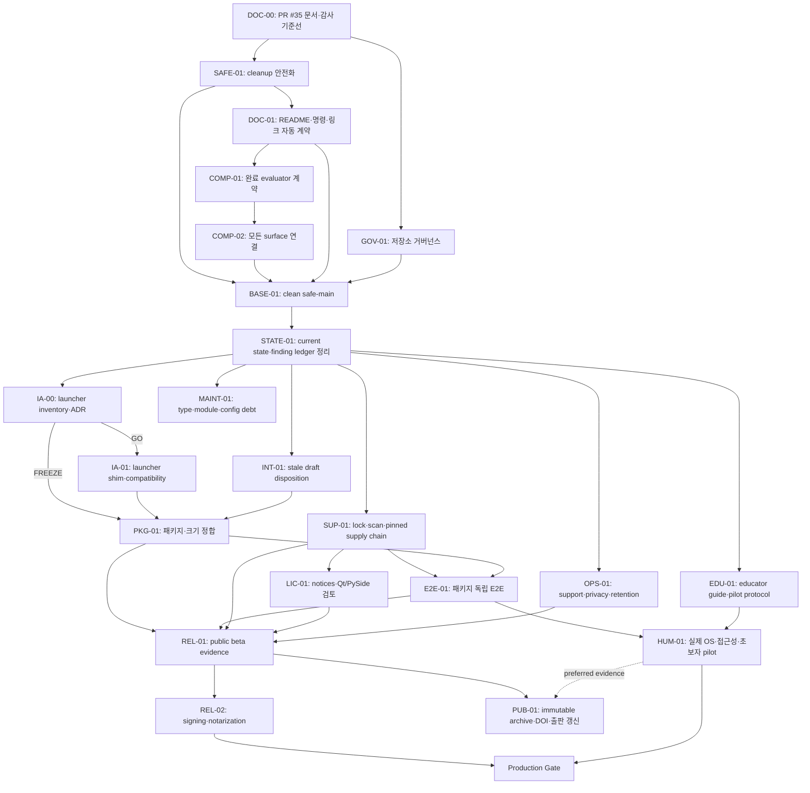

# MCLab 안정화·출시 준비 실행 계획

- 상태: **Execution baseline v15 — SUP-01 accepted; LIC-01 next; PKG-01 parallel**
- 작성일: 2026-07-23 KST
- SAFE-01 구현 기준선: `0fb77a026206f4b25360ace36d70d265a93a9366`
- DOC-01 구현 기준선: `66eca7f666409336a6b9a6052828b3ae1c8b68d7`
- COMP-01 구현 기준선: `c742501de82a8e2500d02d501ecb492e3cf9edb4`
- COMP-02 original merge: `e7e3bdbd6552daed9b6c330656e2755f07f19593`
- COMP-02 original exact source head: `b0468ad361e5313b3634245f23b640318d84680d`
- COMP-02 검증 functional head: `7e54f8cffad7b82408c6352a130a1a463013dfc8`
- COMP-02 original source/merge tree: `a47ac3762103dfb3a989d2fe24b4a2c009282ec7`
- COMP-02 corrective exact head: `ca7a1c9195ff1d07b2b6df9ac5adb60861428bfa`
- COMP-02 corrective merge: `a2266b4f21f9a794998a98e71fa93643cacd1b64`
- COMP-02 corrective source/merge tree: `a0aafbd1b067719f43168523df56dd560dd52da3`
- COMP-02 corrective post-merge runs: CI `29869552669`, desktop
  `29869552662` — required checks **6/6 PASS**
- COMP-02 durable handoff exact head:
  `1399921a3d96f8a67a8b3d3ea5a44a56c6e94685`
- COMP-02 durable handoff merge:
  `ae4d40371b9a3fe4d7078822e1fc541a72defe2d`
- COMP-02 durable handoff source/merge tree:
  `b5f4cb03abbf1e66c14c27c720c737ef2fc4f798`
- COMP-02 durable handoff exact-head runs: CI `29871635697`, desktop
  `29871635771` — required checks **6/6 PASS**
- COMP-02 durable handoff post-merge runs: CI `29873178744`, desktop
  `29873178702` — required checks **6/6 PASS**
- BASE-01 frozen subject/tree:
  `ae4d40371b9a3fe4d7078822e1fc541a72defe2d` /
  `b5f4cb03abbf1e66c14c27c720c737ef2fc4f798`
- BASE-01 accepted candidate head/merge:
  `370b10186864e6b9e2bc73978da13671a54628de` /
  `ee5b89c4116e789c35c76ec82e61d63fd56e5bc8`
- BASE-01 candidate/merge tree:
  `b2ccf3ded8cfd43f15cf24fd9871779fc09e7426` — equivalence **PASS**
- BASE-01 exact-head runs: CI `29878466416`, desktop `29878466425` —
  required checks **6/6 PASS**
- BASE-01 post-merge runs: CI `29885579962`, desktop `29885580009` —
  required checks **6/6 PASS**
- B2 declaration exact head/merge:
  `182aa55edbba676e4c3edf0860aa435bb7763d79` /
  `9eb8eb19cc488d47954268439834667d452d32eb`
- B2 declaration source/merge tree:
  `0c9d562bb040920065075e5c30027e4d5d25db6d` — equivalence **PASS**
- B2 declaration exact-head runs: CI `29887489975`, desktop `29887490014` —
  required checks **6/6 PASS**
- B2 declaration post-merge runs: CI `29888215035`, desktop `29888215028` —
  required checks **6/6 PASS**
- STATE-01 clean implementation base:
  `9eb8eb19cc488d47954268439834667d452d32eb`
- STATE-01 exact head/merge:
  `ba74114126ff875be2f11810c5a0064f50b49000` /
  `6c06de439fbee22ee2591dc47846194484cad517`
- STATE-01 exact-head runs: CI `29890342037`, desktop `29890341985`;
  post-merge runs: CI `29891148900`, desktop `29891148887` — required
  checks **6/6 PASS** at both SHAs
- IA-00 exact head/merge:
  `d7d3c168308c753279c20c4833e29cdd7ef94269` /
  `23689849b31302fab5a370a463f8054f438d0057`; decision **FREEZE**,
  IA-01 **not required** through v0.1/B4
- IA-00 exact-head runs: CI `29892385400`, desktop `29892385399`;
  post-merge runs: CI `29893191982`, desktop `29893192024` — required
  checks **6/6 PASS** at both SHAs
- INT/launcher prerequisites: PR #60 merge
  `7b8c49d8b6aebc5cf8458d313b90253dcc09d98b`, PR #61 merge
  `bc156c2628145fbfa7313de2eaea2323f44dc551`; each exact head and
  merge passed required checks **6/6**
- SUP-01A/B/C merges: `53f9e84e240f70b0d4223fbcd7cd71fe81cc8af2` /
  `941925263e478a68678ccaf21cade22cddddc1ff` /
  `a216ee8b326008ffeae3e139fad65716c19ed341`; every exact head and
  merge passed required checks **6/6**
- SUP-01D exact head/merge:
  `387dd331a408d46beffb80483916401bf2e08c73` /
  `6f0995bd8fe52f8fa6832a03f83254eb13ff9cc1`
- SUP-01D source/merge tree:
  `ac5d9ba1720911357a02c665787ec50ed50eaf5f` — equivalence **PASS**
- SUP-01D exact-head runs: CI `29949569945`, desktop `29949569735`;
  post-merge runs: CI `29950993214`, desktop `29950992873` — required
  checks **6/6 PASS** at both SHAs
- SUP-01 status: **accepted for repository supply-chain input-gate scope**.
  License evidence remains `inventory-complete` / `pending-lic-01`; SBOM
  records are deterministic inputs rather than final per-OS SBOM/provenance,
  and the 22-package Ubuntu manifest does not freeze the hosted base image or
  all native transitive inputs.
- BASE-01 owner acceptance:
  [exact subject/head statement](https://github.com/ycpiglet/manipulator-control-tutorial/pull/56#issuecomment-5041091056)
- BASE-01 evidence status: G1 **12/12 PASS**; B2 `safe-main` **DECLARED**.
  Candidate records remain immutable; the final decision is in the
  [append-only declaration](baselines/B2-safe-main-declaration.md).
- STATE-01 status: **accepted** by the exact-head, protected-merge, and
  post-merge evidence above. Active handoff, immutable
  [history archive](archive/CURRENT_STATE_ARCHIVE_20260722_9eb8eb19.md), and
  append-only [finding-status ledger](reviews/20260720_enterprise_readiness_finding_status.md)
  are separated; the audit source and B2 records remain unchanged.
- 계획 원본 브랜치: `agent/readme-project-handoff` (병합 완료)
- 기준 PR: [#35](https://github.com/ycpiglet/manipulator-control-tutorial/pull/35) (병합 완료)
- 선행 감사: [`reviews/20260720_enterprise_readiness_audit.md`](reviews/20260720_enterprise_readiness_audit.md)

이 문서는 신규 방문자 문서 정리와 전사 준비도 감사 결과를 하나의 실행 순서로
통합한 **권위 있는 작업 계획**이다. 감사에서 발견한 코드 문제를 이 계획 PR에서
수정하지 않는다. 이후 세션은 오래된 대화나 로컬 작업 트리가 아니라 이 문서와
[`CURRENT_STATE.md`](CURRENT_STATE.md)를 먼저 읽고 작업한다.

## 1. 결론

가장 안정적인 순서는 다음과 같다.

1. PR #35로 README, 문서 진입점, 감사 기록, 인수인계 기준선을 병합하고 B1을
   선언했다.
2. 저장소 정책·보호 설정·Actions 고정을 GOV-01A/B/C로 나누어 완료했다.
3. 데이터 손실 위험이 있는 `mclab clean`을 SAFE-01로 닫고, DOC-01에서 KR/EN
   README·공개 명령·링크 계약을 자동화한 다음, 잘못된 학습 완료 판정을 별도의
   COMP-01/02 PR로 수정한다.
4. 두 P0 수정과 저장소 거버넌스가 통과한 깨끗한 `main`을 안전 기준선으로 선언한다.
5. 감사 당시 오래되고 더러운 로컬 작업 트리의 패키징·폰트 변경은 파일 묶음별로
   원격 Draft PR에 보존했다. B2 이후 PR #37의 패키지 제외 변경만 PR #60에서 제한적으로
   채택했고, PR #38은 forward-port 없이 종료했다. 어느 쪽도 작업 트리 전체를 병합하지
   않았다.
6. 패키지 E2E, 의존성 고정, 라이선스, SBOM, 지원·개인정보 안내를 통과시켜 제한된
   기술 프리뷰와 source-first public beta를 구분한다.
7. 실제 장비·보조기술·초보자 검증과 서명·공증·롤백을 통과한 뒤에만 일반 사용자를
   위한 정식 바이너리 배포로 승격한다.
8. 불변 릴리스를 만든 뒤 Zenodo DOI와 출판 메타데이터를 갱신한다. JOSE는 접수 재개를
   외부 조건으로 두고 날짜를 약속하지 않는다.

대규모 디렉터리 이동은 현재 문제의 원인을 해결하지 않으며 재현 경로와 테스트를
깨뜨릴 위험이 크다. IA-00 PR #59는 이득이 없다고 판정해 v0.1/B4까지 루트 launcher를
`FREEZE`로 수용했다. 이를 대체하는 `GO` ADR이 없는 한 IA-01은 수행하지 않으며,
config/model/paper 경로도 이동하지 않는다.

## 2. 사실, 판단, 미결정 사항

### 검증된 사실

- PR #35는 6개 exact-head check를 통과하고 merge commit
  `f04cca16848316e227df18fe129229b515ae01c7`로 병합됐다. merge tree는 source head
  tree와 동일하며 B1의 정확한 증거는
  [`baselines/B1-newcomer-baseline.md`](baselines/B1-newcomer-baseline.md)에 있다.
- B1 exact-head 품질 근거는 438 passed, 2 skipped, 1,088 subtests, Ruff 0,
  statement coverage 81.04%다.
- PR #40 exact head `e26c1ab40d77af0d3744c217736477ef2592251c`는 6/6 required
  check를 통과하고 `41be887f21bfb476507d94a089f98c0ef72453c8`로 병합됐다.
  post-merge CI `29749432294`, 3-OS desktop `29749432322`, Dependabot
  `29749436873`이 통과했고 `sha_pinning_required=true`와 ruleset
  `19209773`이 재확인되어 GOV-01은 완료됐다.
- PR #46 exact head `cca1655dbc4b1d133959df6ad1b77fc3e9e499e9`는 CI
  `29778661706`과 desktop matrix `29778661771`에서 6/6을 통과했다. ruleset을 통해
  merge commit `0fb77a026206f4b25360ace36d70d265a93a9366`가 생성됐고, post-merge
  CI `29779125693`과 desktop matrix `29779125685`도 6/6을 통과해 SAFE-01은
  PASS다. 실제 `outputs/`에는 dry-run이나 apply를 수행하지 않았다.
- 병합된 SAFE-01은 lexical root/ancestor pin, cross-process operation lock,
  2 MiB receipt 상한과 future-state preflight, identity-checked rollback까지 포함한다.
  bulk와 single-result 모두 exact-integer schema-1 terminal manifest만 격리하며,
  새 run/batch writer는 output 재사용을 거부하고 artifact/report 뒤 terminal을
  마지막에 발행한다. desktop all-batch handoff는 token-bound one-shot claim이다.
  독립 로컬 fault-injection·writer-boundary 검토는 source-swap, post-commit,
  rollback, root-identity, output-claim, terminal-publication 범위에서 알려진 P0/P1
  없이 scoped GO를 냈다. frozen-tree Python 3.12는 528 passed, 7 skipped,
  1,109 subtests와 coverage 80.92%를, Python 3.10 cleanup/CLI는 109 passed,
  6 platform-only skipped, 20 subtests를 통과했다. 관련 XCB Qt 감사 18/18,
  Ruff, compileall, Action pin 14/14, diff check도 통과했다. PR #46의
  초기 head `a56e308f2c82b3d346801905fd3bba686ab7da4b`와 두 번째 head
  `7e9fcf701121069be924b220510ab7a107099c0b`가 드러낸 macOS temp alias,
  Windows rename/path/pin/junction, Ubuntu XCB runtime 결함은 실패 기록을
  보존한 채 보수됐다. 최종 exact head와 merge commit에서 Windows·macOS·Ubuntu
  전체가 통과했으며 Ubuntu XCB 감사도 각각 18/18이었다.
- PR #49 exact head `74a77393761025462c3dcdea0c2bfcdfe62b315b`는 CI
  `29811793935`와 desktop matrix `29811793927`에서 required 6/6을 통과했다.
  ruleset을 통해 merge commit `66eca7f666409336a6b9a6052828b3ae1c8b68d7`이
  생성됐고 merge tree는 source-head tree와 동일하다. post-merge CI
  `29812128233`과 desktop matrix `29812128189`도 6/6을 통과해 DOC-01은 PASS다.
  KR/EN 9개 semantic H2, 82개 local link/anchor, 19개 공개 명령, 9개 runtime CLI
  invocation, repository map, launcher와 README core artifact 계약이 자동 gate가 됐다.
  상세 증거는 [`baselines/DOC-01-readme-contract.md`](baselines/DOC-01-readme-contract.md)에
  있다. 디렉터리 이동이나 실제 learner output 작업은 수행하지 않았다.
- PR #51 exact head `95e1be9069349be2c4140932f5f12b3deb99dabb`는 CI
  `29836070679`와 desktop matrix `29836070606`에서 required 6/6을 통과했다.
  ruleset을 통해 merge commit `c742501de82a8e2500d02d501ecb492e3cf9edb4`가
  생성됐고 merge tree `fc0ad88809fc7546c096dd6da2398f60bee324a8`는
  source-head tree와 동일하다. post-merge CI
  `29836511032`와 desktop matrix `29836511019`도 6/6을 통과해 COMP-01은 PASS다.
  versioned completion evaluator와 1,024-case truth matrix, legacy/golden fixture를
  추가했다. exact-head와 post-merge simulator는 각각 691 passed, 9 skipped,
  2,189 subtests와 coverage 80.83%를 기록했다. 소비자 동작, manifest schema,
  실제 learner output은 바꾸지 않았다.
  상세 증거는
  [`baselines/COMP-01-completion-contract.md`](baselines/COMP-01-completion-contract.md)에
  있다.
- COMP-02는 clean fetched
  `origin/main@edaeb340765b076e761f5cd23ac588dda6729ba3`에서 구현 commit
  `872ad7b7ce2949751873c47e7149300c4a521930`으로 시작했다. strict
  schema-1 pinned/bounded/no-link reader, terminal publication/recovery,
  canonical batch rule, desktop/menu/CLI/index/report/worksheet/coverage/path
  연결, ordered wall-preset 저장 E2E를 포함한다. Original PR #53 exact head
  `b0468ad361e5313b3634245f23b640318d84680d`와 merge
  `e7e3bdbd6552daed9b6c330656e2755f07f19593`는 각각 required 6/6을
  통과했고 source/merge tree는
  `a47ac3762103dfb3a989d2fe24b4a2c009282ec7`로 같았다. 그러나 merge 뒤 늦게
  도착한 review thread `PRRT_kwDOTF1rrM6Stevd` /
  `discussion_r3625355867`가 desktop course-progress legacy ID의 reason parity
  누락을 찾았으므로 이 증거만으로 COMP-02 PASS를 유지하지 않는다.
  Corrective PR #54는 base `e7e3bdbd6552daed9b6c330656e2755f07f19593`,
  exact head `ca7a1c9195ff1d07b2b6df9ac5adb60861428bfa`, merge
  `a2266b4f21f9a794998a98e71fa93643cacd1b64`, 동일 source/merge tree
  `a0aafbd1b067719f43168523df56dd560dd52da3`로 해당 진단을 보수했다. 로컬
  Python 3.10 회귀는 827 passed, 7 skipped, 2,422 subtests와 coverage
  82.45%를, focused parity는 7 passed와 6 subtests를 기록했다. Corrective
  exact-head CI `29867670314`와 desktop matrix `29867670323`은 required
  6/6을 통과했고 remote simulator는 822 passed, 12 skipped, 2,420 subtests,
  coverage 82.20%를, Python 3.10 floor는 109 passed, 6 skipped, 20 subtests를
  기록했다. Corrective post-merge CI `29869552669`과 desktop matrix
  `29869552662`도 required 6/6을 통과했고 같은 remote simulator와 Python 3.10
  수치를 기록했다. Late PR #53 thread는 이 증거 뒤 재조회하고 resolve했으며 PR
  #54에는 review, comment, thread가 없다. 따라서 COMP-02와 completion-consumer G1
  범위는 PASS다. 상세 durable 증거는
  [`baselines/COMP-02-completion-consumers.md`](baselines/COMP-02-completion-consumers.md)에
  있다. 실제 learner output은 건드리지 않았다.
- COMP-02 이전 기준선 `origin/main@edaeb340`의 Desktop 완료 판정은 manifest의
  `status == "completed"`를 중심으로 세며 catalog/menu가 약속한 plot, control,
  prediction, observation 증거와 불일치했다. Original PR #53가 strict evidence와
  canonical evaluator로 주된 불일치를 제거했고 corrective PR #54가 raw legacy
  scenario-ID diagnostic parity를 desktop path까지 일치시켰다. 기존 artifact는
  rewrite하지 않는다.
- 감사 시점 로컬 checkout은 원격 main보다 오래되었고 패키징과 폰트 변경이 섞여
  있었다. 이것은 release candidate가 아니다.
- B1 선언 시점에는 없던 branch ruleset, vulnerability/security settings,
  immutable Action pin은 GOV-01로 완료됐다. SUP-01A/B/C는 reviewed Node24
  Action lock, universal hash-locked Python profiles, pinned Panda runtime
  closure를 추가했고 SUP-01D PR #66은 fail-closed vulnerability/license
  inventory, pinned Ubuntu direct-package evidence와 deterministic SBOM input
  contract를 추가했다. SUP-01 registry scope는 accepted지만 LIC-01 notices와
  Qt/PySide 결정, final OS SBOM/provenance, native/base transitive inventory,
  immutable release와 tag는 아직 준비되지 않았다.
- 3개 OS CI는 unsigned development folder의 self-test와 `doctor`를 검증하지만,
  독립 설치부터 report/replay/next/cleanup까지의 패키지 E2E와 실제 사용자 장비를
  검증하지 않는다.

### 계획상 판단

- 학습 완료는 단순 실행 성공이 아니라 해당 scenario가 선언한 학습 증거를 저장한
  상태로 정의한다. 자동 scenario는 control/observation을 요구하지 않을 수 있다.
- 공개 beta의 기본 형태는 source-first로 한다. 서명되지 않은 CI bundle은 계속
  `UNSIGNED DEVELOPMENT BUILD`로 표시하고 일반 다운로드 바이너리처럼 홍보하지 않는다.
- 배포 크기는 **압축 archive 300 MiB 이하**와 **one-folder 400 MiB 이하**를 서로
  다른 지표로 유지한다. 기준 변경은 측정 근거와 owner 승인이 있는 별도 결정이다.
- 기존 learner manifest는 소급 수정하지 않는다. 새 evaluator가 버전별 읽기 호환성을
  제공하고 판정 이유를 표시한다.

### Product/Release Owner가 결정해야 하는 항목

1. 다음 목표를 supervised classroom, invited technical preview, source public beta,
   signed production 중 어디까지로 할지.
2. 공식 지원 OS와 macOS Intel 지원 여부.
3. Windows signing과 Apple Developer/notarization 자격을 지금 확보할지.
4. 외부 license 검토자와 초보자 6명 이상·교육자 1명의 pilot을 누가 조정할지.
5. 첫 prerelease version을 `v0.1.0-beta.1`로 할지와 공개 지원 채널.

결정을 기다리는 동안 P0 안전성, 자동 검증, notice 초안, pilot protocol은 진행할 수
있다. 자격 증명 사용, 외부 연락, participant 모집 실행, release/DOI 발행은 명시적
권한이 필요하다.

### 역할과 승인 책임

| 역할 | 책임과 승인 범위 | 주요 외부 의존성 |
|---|---|---|
| Product/Release Owner | 지원 범위, beta/production 위험 수용, 최종 GO/NO-GO | 사용자 결정 |
| Safety Maintainer | SAFE-01, COMP-01/02, output/config 호환성 | 독립 코드 review |
| QA Lead | 자동 gate, packaged E2E, 실제 OS/GPU, rollback evidence | 실제 장비 |
| Security/Compliance Lead | lock, vulnerability, SBOM, notices, Qt/PySide 의무 | 필요 시 license 자문 |
| Platform Release Lead | installer, signing, notarization, checksum, protected secrets | Apple/Windows 자격 |
| Documentation/IA Owner | KR/EN 계약, newcomer flow, launcher compatibility | newcomer review |
| Pedagogy Lead | 학습 완료 의미, educator guide, pilot·rubric·익명화 | 참여자/교육자 |
| Publication Owner | release archive, CFF, Zenodo, JOSE/KROS state | ORCID/Zenodo/venue |

한 사람이 여러 역할을 맡을 수 있으나 destructive cleanup, completion semantics,
signing/release 변경은 작성자 자신만의 확인으로 승인하지 않는다. 최소한 별도 review와
재현 가능한 evidence를 남긴다.

## 3. 구성 기준선과 통제 대상

| 기준선 | 선언 시점 | 내용 | 승격 조건 |
|---|---|---|---|
| B0 `audit-docs` | 과거 | main `44b1937` + PR #35의 당시 live head | G0 |
| B1 `newcomer-baseline` | **현재 선언됨** | `f04cca16848316e227df18fe129229b515ae01c7` | [G0 evidence](baselines/B1-newcomer-baseline.md) 보존 |
| B2 `safe-main` | **현재 선언됨** | `ae4d40371b9a3fe4d7078822e1fc541a72defe2d` | [G1 declaration](baselines/B2-safe-main-declaration.md) 보존 |
| B3 `technical-preview-rc` | 독립 package E2E 후 | 내부 초대용 exact commit과 known issues | G2 |
| B4 `public-beta` | supply-chain/legal/support 후 | 장기 보존 prerelease와 release evidence | G3 |
| B5 `signed-production` | 실기기·접근성·서명 후 | 서명·공증된 배포와 검증된 rollback | G4 |
| B6 `scholarly-archive` | 불변 release 후 | archive, citation metadata, DOI | G5 |

각 기준선은 exact commit SHA, config/model hash, dependency lock hash, workflow run,
검증 결과, 생성 시각을 CI artifact의 `build/validation/<commit-sha>/` 또는 release
evidence archive에 기록한다.
아직 dependency lock을 요구하지 않는 B1/B2에서는 lock hash를 꾸며내지 않고
`N/A — SUP-01 pending`과 그 이유를 기록한다.
기존 기준선을 덮어쓰지 않는다.
사람이 읽는 선언서는 `.agents/baselines/<baseline-id>.md`에 만들고, 관련 machine-readable
evidence 경로와 CI URL을 연결한다.

통제 대상은 다음과 같다.

- 제품 코드와 CLI/QML: `src/mclab/`
- 재현 입력: `configs/`, `models/`, pinned `third_party/` assets
- 자동 검증: `tests/`, `scripts/`, `.agents/validation/`, workflows
- 배포 정의: `pyproject.toml`, packaging spec, lock/constraints, release workflow
- 사용자 계약: KR/EN README, `docs/`, `SECURITY.md`, `SUPPORT.md`, notices
- 출판: `paper/`, `jose/`, `CITATION.cff`

`outputs/`, `dist/`, cache, local virtual environment, generated PDF와 임시 audit 결과는
소스 기준선이 아니다. release evidence로 명시적으로 채택한 산출물만 보존 대상이다.

## 4. 작업 원칙

1. 모든 구현 브랜치는 최신 `origin/main`에서 새 clean worktree로 만든다.
2. 한 PR은 한 위험 또는 한 검증기만 담당한다. 안전 수정과 구조 refactor를 섞지 않는다.
3. P0 PR은 fixture/temp directory만 사용한다. 실제 `outputs/`에 destructive test를
   실행하지 않는다.
4. `mclab clean`은 SAFE-01 병합 후 post-merge required check를 재검증하고
   PASS를 기록할 때까지 사용자 안내와 검증 명령에서 금지한다. PASS 뒤에도
   실제 outputs root dry-run은 별도 owner 참여·승인 작업에서만 만든다. Owner가 그
   exact plan을 검토한 뒤 같은 plan의 `--apply`를 다시 명시적으로 승인하기 전에는
   실행하지 않는다.
5. 병렬 브랜치는 merge 직전에 최신 main으로 rebase하고 전체 필수 CI를 다시 통과한다.
6. check가 하나라도 red이면 merge하지 않는다. threshold를 낮추거나 test를 지워서
   통과시키지 않는다.
7. 사용자·동시 작업자의 dirty 파일을 commit, stash, reset, delete하지 않는다.
8. 기존 manifest/config 경로와 launcher는 최소 한 release 동안 읽기 shim을 유지한다.
9. 외부 setting 변경, signing, release, DOI, 이메일/participant 연락은 실행 전 owner
   권한과 변경 기록을 확인한다.
10. 각 merge 뒤 `CURRENT_STATE.md`의 현재 SHA, 통과 gate, 다음 단일 작업을 갱신한다.

## 5. 의존성 그래프



PUB-01은 registry와 Wave 6에 따라 최소 REL-01/G3 immutable release를 요구하고
HUM-01 evidence를 권장한다. REL-02/G4 production은 PUB-01의 필수 선행 조건이
아니지만, publication claim이 실사용 검증을 포함하면 해당 HUM evidence가 먼저
있어야 한다.

장기 선행 작업의 내부 checklist·inventory·protocol 초안은 병렬로 준비할 수 있다.
Signing 자격 취득/사용, 실제 장비 구매·대여, 외부 license 검토자 접촉, participant
모집·연락은 owner의 별도 명시적 권한 전에는 시작하지 않는다. 그 외부 evidence가
없으면 관련 gate는 통과하지 못한다.

## 6. 작업 패키지 등록부

| ID | 책임 역할 | 의존 | 크기 | 산출물과 핵심 통과 기준 |
|---|---|---|---|---|
| DOC-00 | Documentation owner | 없음 | S | PR #35, KR/EN 0 broken links, 6 checks green, human review |
| DOC-01 | Documentation owner | SAFE-01 | S | KR/EN semantic contract, 공개 명령, local link/anchor, repository-map 자동 gate와 newcomer truth review |
| GOV-01A | Repository admin + Security lead | DOC-00 | S | CODEOWNERS, SECURITY/SUPPORT, PR template, contribution and B1 policy records |
| GOV-01B | Repository admin | GOV-01A | S | protected main ruleset, exact required checks, PR/conversation requirements, vulnerability alerts, Dependabot security updates, private reporting, verified settings snapshot |
| GOV-01C | Security lead | GOV-01B | M | every third-party Action pinned to a reviewed full commit SHA with updater policy and green replacement runs |
| GOV-01 | Repository admin + Security lead | GOV-01A/B/C | S/M | aggregate gate; never complete and never sufficient for B2 until A, B, and C all pass |
| SAFE-01 | Safety maintainer | DOC-00 | M | validated output root, manifest-only selection, internal/symlink/broad-root exclusion, dry-run, recovery and failure tests |
| COMP-01 | Safety/Pedagogy maintainer | DOC-01 | M | read-only canonical completion evaluator, versioned reason, legacy/golden contract fixtures |
| COMP-02 | App/Reporting maintainer | COMP-01 | M | identical desktop/menu/CLI/index/report verdicts through the canonical evaluator |
| BASE-01 | Release owner | GOV-01, SAFE-01, DOC-01, COMP-02 | S | clean current-main SHA, zero open B2-scope blocker, evidence manifest |
| INT-01 | Feature owners | STATE-01 | M | stale packaging/font changes reviewed; bounded hunk reapplied or superseded/closed, never wholesale copied |
| PKG-01 | Platform lead | IA-00 결정, IA-01 (GO 시), INT-01 결정 | M | one-folder/archive metrics aligned; cold launch and actual QML gate |
| SUP-01 | Security lead | STATE-01 | M | hash lock/constraints, pinned Menagerie path, vulnerability/license scans, SBOM inputs |
| LIC-01 | Compliance owner | SUP-01 | M/external | 100% distribution inventory, notices, Qt/PySide LGPL compliance decision |
| E2E-01 | QA lead | SUP-01, PKG-01 | L | supported OS install→doctor→run→report→replay→next→cancel→safe cleanup |
| OPS-01 | Support owner | STATE-01 | M | privacy/local-data, shared-PC deletion, support, incident, backup/restore/retention guides |
| EDU-01 | Pedagogy lead | STATE-01 | M/external | educator guide, pilot protocol, learning outcome rubric |
| STATE-01 | Project-state owner | BASE-01 | S | live state를 active handoff로 축소, 과거 archive, immutable audit finding-status ledger |
| IA-00 | Developer experience owner | BASE-01 (draft), STATE-01 (merge) | S | no-move inventory/ADR, from→to refs, package/CI/docs 영향, rollback과 beta 전 실행/동결 결정 |
| IA-01 | Developer experience owner | IA-00 GO | M | launcher consolidation with one-release shims; no config/model/publication moves |
| REL-01 | Release lead | PKG/E2E/SUP/LIC/OPS | L | protected beta tag, checksum, SBOM, provenance, known issues, long-lived artifacts |
| REL-02 | Platform release lead | REL-01 | L/external | Authenticode, macOS sign/notarize/staple, Linux signature, protected secrets |
| HUM-01 | QA + Pedagogy | E2E-01, EDU-01 | L/external | real OS/GPU/200%, NVDA/VoiceOver/Orca, >=6 beginners and educator pilot |
| MAINT-01 | Architecture owner | STATE-01 | L | no new mypy debt, incremental typing, module splits, config-contract decision |
| PUB-01 | Publication owner | REL-01; ideally HUM-01 | M/external | immutable archive, CITATION/version sync, Zenodo DOI, JOSE/KROS state refresh |

S는 약 1개 PR, M은 1~3개 PR, L은 여러 PR과 별도 검증 기간을 뜻한다. 일정 약속이
아니며 gate evidence를 줄이는 근거로 사용하지 않는다.

### 권장 PR queue

| 순서 | 브랜치/작업 | 선행 조건 | merge 또는 종료 결과 |
|---|---|---|---|
| 0 | 기존 `agent/readme-project-handoff` / DOC-00·본 계획 | 완료 | PR #35 병합, B1 선언 |
| 1a | `agent/governance-baseline` / GOV-01A | 완료 | PR #39 병합, policy baseline |
| 1b | repository settings / GOV-01B | 완료 | active ruleset `19209773`와 security settings API snapshot |
| 1c | `agent/pin-actions` / GOV-01C | 완료 | PR #40 병합, 6/6 replacement checks, SHA enforcement |
| 2 | `agent/safe-output-cleanup` / SAFE-01 | 완료 | PR #46 병합, exact-head·post-merge 6/6, SAFE-01 PASS |
| 3 | `agent/readme-contract-gates` / DOC-01 | 완료 | PR #49 병합, exact-head·post-merge 6/6, 자동 문서 계약 |
| 4 | `agent/completion-contract` / COMP-01 | 완료 | PR #51 병합, versioned evaluator와 exhaustive golden truth contract |
| 5 | `agent/completion-consumers` / COMP-02 | 완료 | PR #53 및 late-thread correction PR #54, exact-head·post-merge 6/6, thread resolved |
| 6 | `agent/safe-main-baseline` / BASE-01 | 완료; PR #56 merge·post-merge 6/6, G1 12/12 | immutable candidate + append-only B2 declaration |
| 7a | `agent/project-state-ledger` / STATE-01 | 완료; PR #58 | concise live state, immutable history archive, append-only 19-finding ledger |
| 7b | `agent/repository-ia-decision` / IA-00 | 완료; PR #59 | 23 launcher path FREEZE through v0.1/B4 |
| 7c | `agent/launcher-compatibility` / IA-01 | N/A | IA-00 FREEZE; superseding GO ADR 전에는 만들지 않음 |
| 8a | Draft PR #38 / INT-01 font | 종료; superseded | native Windows glyph evidence 없이 forward-port하지 않음 |
| 8b | Draft PR #37 / INT-01 package | 완료; PR #60 bounded adoption | structural exclusion과 same-workflow measurement만 재적용 |
| 9 | `agent/dependency-reproducibility` / SUP-01 | 완료; PR #62–#64와 #66 | lock, pinned asset/action, fail-closed scans, Ubuntu direct-package evidence, deterministic SBOM inputs |
| 10 | `agent/third-party-notices` / LIC-01 | accepted SUP-01 inventory | **다음**; notices, source/text coverage, Qt/PySide compliance 승인 |
| 11 | `agent/package-release-metrics` / PKG-01 | IA-00 결정, IA-01 (GO 시), INT-01 결정 | 병렬 가능; size/startup contract |
| 12 | `agent/packaged-e2e` / E2E-01 | accepted SUP-01 + PKG-01 | supported OS E2E evidence |
| 13 | `agent/support-privacy-retention` / OPS-01 | STATE-01 | 운영·데이터 보호 문서/검증 |
| 14 | `agent/educator-pilot-kit` / EDU-01 | STATE-01 | protocol/guide; pilot 자체는 외부 일정 |
| 15 | `agent/beta-release` / REL-01 | G3 | B4 prerelease 또는 NO-GO 기록 |
| 16 | `agent/platform-accessibility-validation` / HUM-01 | E2E/EDU | 실제 장비·pilot evidence |
| 17 | `agent/signed-release` / REL-02 | G3 + credentials | B5 또는 NO-GO 기록 |
| 18 | `agent/publication-release-sync` / PUB-01 | immutable release | B6/DOI; JOSE는 external-blocked 가능 |
| 19+ | 작은 `agent/maint-*` / MAINT-01 | STATE-01 | type/module/config debt를 작은 revert 단위로 감소 |

7b의 read-only draft를 7a와 병렬로 준비하고 accepted STATE-01 뒤 병합한 순서는
historical evidence로 보존됐다. 현재 STATE/IA/INT와 SUP-01 disposition은 끝났다.
LIC-01이 다음 ordered compliance lane이고 PKG-01, OPS-01, EDU-01, MAINT-01은 파일
ownership과 registry prerequisite가 겹치지 않을 때 병렬로 진행할 수 있다.
PKG-01→E2E-01은 B3 technical-preview critical path이고 E2E-01은 accepted PKG-01이
추가된 exact main에서 수행한다. 표의 순서는 위험과 최종 merge 의존성을 뜻하며 모든
작업을 직렬화하라는 의미는 아니다.

## 7. 단계별 실행 순서

### Wave 0 — 문서·인수인계 기준선 고정 — 완료

1. PR #35의 diff를 human review한다.
2. README quickstart와 KR/EN 의미·명령 parity를 재확인한다.
3. 6개 check를 exact head에서 확인하고 감사와 문서 변경의 추적성이 보존되는 merge
   전략으로 병합한다.
4. 병합 SHA를 B1로 기록하고 이 문서의 PR 번호·상태를 갱신한다.

완료 결과: G0 PASS. PR #35와 B1 선언서에 exact-head 증거가 보존됐다.

### Wave 1 — 안전성·거버넌스

병렬 lane:

- Lane A `agent/safe-output-cleanup`: SAFE-01
- Lane D `agent/readme-contract-gates`: DOC-01; SAFE-01 병합 뒤 시작
- Lane B1 `agent/completion-contract`: COMP-01; DOC-01 병합 뒤 시작
- Lane B2 `agent/completion-consumers`: COMP-02; COMP-01 병합 뒤 시작
- Lane C `agent/repository-governance`: GOV-01A 정책 → GOV-01B 설정 → GOV-01C
  Actions full-SHA 고정

SAFE-01과 GOV-01A/C는 파일상 독립 PR로 개발할 수 있다. 권장 merge 순서는
GOV-01A, GOV-01B 설정 검증, GOV-01C, SAFE-01, DOC-01, COMP-01, COMP-02였다.
당시 저장소 setting에 필요한 owner 권한이 늦어져도 SAFE-01 review는 계속하되,
B2는 모든 조건이 끝나기 전에 선언하지 않았다.
각 후속 PR은 최신 main으로 rebase한다. GOV-01B의 required checks는 현재 6개 exact
check name과 admin recovery 절차를 확인한 뒤 켠다. SHA 고정 enforcement는 GOV-01C가
모든 workflow를 고정하고 replacement runs가 green인 뒤에만 켠다.

현재 저장소는 single-maintainer 구조라 작성자와 별개의 human approval을 강제로
요구하면 정상 PR도 merge할 수 없다. 두 번째 human collaborator가 생기기 전까지는
required approvals를 0으로 두되 PR 자체, 6개 exact-head check, conversation resolution,
CODEOWNERS routing, owner의 명시적 위험 수용, 독립 read-only agent review 기록을 모두
요구한다. 이것은 formal independent human approval이 아니며 B2 선언서에 예외로
명시한다. 두 번째 human maintainer가 추가되면 required approval 1과 code-owner
approval을 켜는 별도 setting change를 수행한다.

2026-07-22 현재 Lane C의 GOV-01A/B/C, Lane A의 SAFE-01, Lane D의 DOC-01,
Lane B1의 COMP-01과 Lane B2의 COMP-02는 완료됐다.
SAFE-01 exact head `cca1655d`와 merge commit `0fb77a0`에서 required 6/6과
원격 3-OS 결과를 각각 통과했다. 실제 learner outputs에는 dry-run이나 apply를
수행하지 않았다. DOC-01 exact head `74a7739`와 merge commit `66eca7f`에서도
required 6/6과 원격 3-OS 결과를 각각 통과했다. COMP-01 exact head `95e1be9`와
merge commit `c742501`도 required 6/6과 원격 3-OS 결과를 각각 통과했다.
Lane B2의 original PR #53 exact head `b0468ad`와 merge `e7e3bdb`는 required
6/6과 source/merge tree 동일성을 통과했지만 late review가 raw legacy ID reason
parity 누락을 찾았다. Corrective PR #54 exact head `ca7a1c9`는 required 6/6을
통과하고 `a2266b4`로 병합됐으며 source/merge tree도 동일하다. Merge-SHA CI
`29869552669`과 desktop matrix `29869552662`도 required 6/6을 통과했고 late
thread는 corrective evidence 확인 뒤 resolved됐다. Wave 1과 COMP-02는 PASS다.
Durable handoff PR #55도 exact head `1399921a`에서 required 6/6을 통과하고
`ae4d4037`로 병합됐으며, merge-SHA CI `29873178744`와 desktop matrix
`29873178702`도 6/6을 통과했다. BASE-01은 이 merge를 frozen subject로 사용해
clean tree, G1 기술 지표, live governance, B2-scope code/config blocker 0을
재집계했다. Candidate PR #56은 최종 head `370b1018`에서 required 6/6과 독립
read-only review를 통과했다. Owner는 frozen subject와 exact head를 함께 명시해
single-maintainer 위험을 수용했고, PR #56은 `ee5b89c4`로 병합됐다. Source/merge
tree는 `b2ccf3de`로 동일하며 merge-SHA CI `29885579962`와 desktop matrix
`29885580009`도 6/6을 통과했다. G1은 12/12 PASS이고 B2 `safe-main`은 append-only
declaration record로 선언됐다. Candidate Markdown/JSON은 record-creation snapshot으로
그대로 보존한다. Declaration PR #57 exact head `182aa55e`와 protected-main merge
`9eb8eb19`도 각각 required 6/6을 통과했고 source/merge tree는 `0c9d562b`로
동일하다. STATE-01은 그 clean main에서 live handoff를 150줄 이하로 축소하고,
이전 731줄 이력과 19개 감사 finding의 append-only status ledger를 분리했다. 감사
원문과 B2 candidate/declaration record는 수정하지 않았다.

완료 결과: BASE-01/B2 G1 12/12, exact-head·post-merge 6/6, owner acceptance,
source/merge tree equivalence, review conversation resolution PASS.
회귀하면 affected feature를 비활성화하거나 protected-main corrective PR로
복구한다.

### Wave 2 — 깨끗한 안전 기준선과 보류 변경 재적용 — 완료

1. `9eb8eb19`의 clean worktree에서 STATE-01을 격리하고 PR #58로 병합했다.
   Exact-head와 post-merge required checks는 각각 6/6을 통과했다.
2. IA-00 PR #59는 root launcher 23개를 v0.1/B4까지 FREEZE했다. IA-01은 이
   결정 아래 N/A이며, path move는 없었다.
3. Draft #37의 package exclusion은 구조 검증과 same-workflow 측정을 갖춘 PR #60의
   두 파일만 채택했다. Draft #37 자체는 superseded로 닫혔다.
4. Draft #38 static-font 복구는 native packaged-Windows glyph evidence가 없고 약
   24.5 MiB를 추가하므로 forward-port하지 않고 superseded로 닫았다.
5. IA inventory가 찾은 `run_mclab.cmd` clean/dev-only bootstrap 결함은 path를
   유지한 PR #61로 보수했다.
6. PR #58–#61은 모두 exact-head와 post-merge required checks 6/6을 통과했다.
   어느 stale Draft도 wholesale merge하지 않았다.
7. B2 declaration의 `N/A — SUP-01 pending`은 record-creation 당시 사실로 보존한다.
   이후 accepted SUP-01 상태는 append-only finding event와 live state가 기록하며
   B2 record를 소급 수정하지 않는다.

완료 조건: B2가 clean이고 B2 범위 blocker가 0개다. 여기에는 P0-01 cleanup,
P0-02 completion, P0-03 clean baseline과 P0-05의 GOV-01 하위 항목이 포함된다.
P0-04 distribution/signing, P0-05의 immutable release/tag, LIC/PKG/E2E와 final
SBOM/provenance는 후속 gate에 남아 있으므로 B2나 accepted SUP-01이 public-beta GO를
뜻하지 않는다. 더러운 checkout은 참고 자료일 뿐 merge source가 아니다.

### Wave 3 — 제한된 technical preview

권장 dependency order:

1. `agent/dependency-reproducibility` — SUP-01 **accepted**
2. accepted SUP-01 inventory 뒤 `agent/third-party-notices` — LIC-01 **다음**
3. IA-00/INT-01 결정과 조건부 IA-01 뒤
   `agent/package-release-metrics` — PKG-01 **병렬 가능**
4. accepted PKG-01이 추가된 exact main에서
   `agent/packaged-e2e` — E2E-01
5. STATE-01 뒤 독립 lane `agent/support-privacy-retention` — OPS-01
6. STATE-01 뒤 독립 lane `agent/educator-pilot-kit` — EDU-01

각 registry prerequisite를 충족한 서로 독립적인 작업만 병렬화한다. Package E2E는
accepted SUP-01과 PKG-01을 모두 포함한 exact commit에서 다시 수행한다. SUP-01D의
14일 scanner/APT artifact는 development evidence이며 release provenance가 아니다.
Unsigned build artifact는 trusted invited preview로만 사용한다.

완료 조건: G2. 실패 플랫폼은 preview 지원 목록에서 제외한다.

HUM-01은 registry대로 E2E-01과 EDU-01이 모두 완료되고 owner가 실제 장비·사람
검증을 승인하면 시작할 수 있다. REL-01은 HUM-01의 선행 조건이 아니다.

### Wave 4 — source-first public beta

1. G3의 safety, quality, supply-chain, legal, support 조건을 모두 닫는다.
2. `v0.1.0-beta.1` 후보를 protected main의 exact SHA에서 만든다.
3. GitHub prerelease에 source archive, 장기 보존 artifact, SHA-256, SBOM, provenance,
   notices, known limitations, supported OS, unsigned 상태를 함께 제공한다.
4. checksum/SBOM/restore를 다른 clean machine에서 검증한 후 GO/NO-GO를 기록한다.

서명 없는 일반 사용자용 binary를 public beta의 기본 다운로드로 승격하지 않는다.

### Wave 5 — signed production·교실 운영 품질

HUM-01 evidence는 위 선행 조건을 충족하면 Wave 4/REL-01보다 먼저 수집할 수 있다.
이 절은 REL-02 결과와 HUM-01 결과를 G4 production gate에서 함께 판정하는 순서이며,
HUM-01에 REL-01 의존성을 추가하지 않는다.

1. protected environment와 수동 승인으로 signing secrets를 사용한다.
2. Windows Authenticode, macOS signing/notarization/stapling, Linux checksum/signature를
   실제 release artifact에서 검증한다.
3. 실제 지원 OS/GPU/200% scaling/restart와 보조기술 검증을 수행한다.
4. 초보자 >=6명과 교육자 >=1명의 독립 pilot을 수행하고 결과를 익명 집계한다.
5. N-1→N upgrade와 N rollback을 drill하고 learner outputs가 보존되는지 확인한다.

완료 조건: G4. 미해결 Sev1/Sev2가 있거나 rollback이 실패하면 production NO-GO다.

### Wave 6 — 학술 아카이브·출판

1. 최소 G3를 통과한 immutable release와 exact commit 재현 근거를 만든다.
2. generated learner notes/outputs와 개인정보가 archive에 없는지 확인한다.
3. `CITATION.cff`, authors/ORCID, license, version, 실제 CI test count를 동기화한다.
4. owner가 Zenodo 연결을 승인·활성화하고 release archive와 DOI의 commit/version
   일치를 확인한다.
5. JOSE paper의 과거 수치, 날짜, 사용 경험, 한계를 tagged release에 맞춘다.

2026-07-20 현재 [JOSE 공식 사이트](https://jose.theoj.org/)가 eligibility 변경 논의
중 접수 중단 상태라고 공지하므로 submission date를 잡지 않는다. Zenodo software DOI
준비는 JOSE와 독립적으로 진행할 수 있다.

## 8. 검증 게이트

모든 자동 gate 결과는 가능한 경우
`build/validation/<commit-sha>/<gate-id>.json`에 commit, OS, Python/tool version,
threshold, measurement, result, timestamp를 기록하고 CI artifact로 업로드한다.
`build/`는 generated source가 아니므로 commit하지 않는다. RC 증거는 같은 commit에서
재생성하고 90일 이상 보존한다. 정식 release evidence는 하나의 manifest/archive로
release에 첨부하여 영구 보존한다.

### G0 — 문서·인수인계 기준선

| Metric | Threshold | Evidence | Failure action |
|---|---|---|---|
| PR checks | 6/6 green at exact SHA | GitHub check URLs | merge 중단 |
| KR/EN contract | semantic H2와 공개 명령 100% 대응 | `check_readme_contract.py`: 9/9 H2, 공개 명령 19/19 | 양쪽 동시 수정 |
| docs links | local links/anchors error 0 | DOC-01 exact-head와 post-merge: 82 checked, 0 error | broken link 수정 |
| quickstart truth | clean setup, doctor, Lab01 exit 0 and promised artifacts 100% | DOC-01 desktop matrix Windows/Ubuntu/macOS 3/3 | 지원 문구 수정 또는 flow 복구 |

README/CLI 변경 때 D1/D2를 PR-blocking 자동화하는 작업은 DOC-01에서 추가했다.
SAFE-01은 DOC-01 이전에 시작된 마지막 transitional exception으로서 KR/EN H2·공개
명령 parity, local link/anchor, repository-map을 수동 기록하고, 이후 README/CLI 변경은
DOC-01 checker 없이는 병합하지 않는다.

### G1 — 안전한 개발 기준선

| Metric | Threshold | Evidence | Failure action |
|---|---|---|---|
| cleanup selection | valid learner run 선택 100%; internal/invalid/symlink/canary 선택 0 | >=30 mixed temp cases + property cases | command 비활성화 |
| protected roots | home/workspace/repo root, ancestor, filesystem root 거부 100% | platform path matrix | merge/release 중단 |
| cleanup intent | default dry-run; exact resolved plan; `--apply PLAN_ID --yes` 전 이동 0 | plan JSON and CLI tests | safe default 복구 |
| cleanup result | plan/execution set 동일; quarantine failure silent 0; receipt/list/restore와 interruption recovery 검증 | temp trash/staging test | non-zero exit, recover/revert |
| completion truth | declared status/plot/control/prediction/observation truth table 100% | canonical evaluator matrix | progress update 차단 |
| surface parity | desktop/menu/CLI/index/report verdict mismatch 0 across catalog | cross-surface contract tests | canonical API로 복구 |
| legacy data | existing manifest rewrite 0; deterministic reason shown 100% | legacy fixture tests | migration/rewrite 중단 |
| repository rules | active `main` ruleset 1; PR/conversation/up-to-date required; force-push/deletion blocked; exact required checks 6/6 | post-change GitHub API snapshot | ruleset disable 또는 수정 후 재검증 |
| security settings | vulnerability alerts, Dependabot security updates, private vulnerability reporting enabled 3/3 | post-change GitHub API status | 정책 공개 중단 또는 즉시 setting 복구 |
| workflow provenance | third-party `uses:` refs reviewed full 40-hex SHA 100%; replacement checks 6/6 | workflow scanner + exact-head CI | enforcement를 켜지 않고 PR 수정 |
| review topology | 현재 direct collaborator 1명 예외와 owner risk acceptance 기록 100%; 두 번째 human 추가 시 approval 1로 승격 | collaborators/ruleset snapshot + PR record | B2 선언 중단 |
| base quality | Ruff 0, pytest failure 0, coverage >=80% | CI | merge 중단 |

명시적 회귀 case: `status=completed`이지만 요구 증거가 없으면 incomplete이고, 모든 요구
증거가 있으면 complete다. 자동 scenario에는 catalog가 요구하지 않는 control을 강제하지
않는다.

### G2 — 제한된 technical preview

| Metric | Threshold | Evidence | Failure action |
|---|---|---|---|
| package independence | 지원 OS마다 source checkout 밖 self-test, doctor, Lab01, report, replay 100% | `package_e2e.json` | 해당 OS artifact 폐기 |
| process lifecycle | cancel/close 후 orphan child 0, comparison cleanup 100% | process-tree logs | preview 범위 축소 |
| full course | 5 batches, 54 runs, 6 reports, comparison plots >=5, <=300 s, UI gap <=500 ms, output <=150 MiB | `audit_course_comparison.py` | regression 수정 |
| reproducibility | same config+seed 3회 핵심 metric 허용오차 내 100%, hash error 0 | repeat/diff JSON | deps/seed 고정 |
| package size | one-folder <=400 MiB; compressed archive <=300 MiB | OS별 size JSON | graph 최적화; 기준 조용히 상향 금지 |
| startup | 지원 OS cold launch >=20회, p95 <=5 s, failure 0 | startup audit | profile 후 수정 |

### G3 — public beta

| Metric | Threshold | Evidence | Failure action |
|---|---|---|---|
| dependency reproducibility | runtime/package deps 100% version+hash fixed; two clean installs identical | lock and diff | artifact build 중단 |
| vulnerabilities | unmitigated runtime Critical/High 0; Medium waiver <=30 days | scanner JSON/SARIF | upgrade/remove |
| licenses | shipped component SPDX/copyright/text/source coverage 100%, UNKNOWN 0 | notice inventory | 공개 배포 중단 |
| SBOM/provenance | OS별 valid SBOM, Panda 포함, SHA-256/provenance 100% | release evidence | artifact 재생성 |
| repository controls | protected main, required checks/review, alerts, security/support path 모두 active | settings snapshot | release 중단 |
| local data | note/output location, export/delete, shared-PC guidance 100% documented/tested | doc review + restore test | guide/flow 수정 |
| newcomer comprehension | 새 참여자 >=5명 중 >=4명이 30초 안에 저장소 목적·대상·첫 실행·비대상을 정확히 설명 | 익명 4문항 sheet | README 첫 화면 재설계 |
| release identity | tag/app/manifest/file version 100% 동일; dirty tree 0 | release manifest | tag/artifact 폐기 |

### G4 — signed production·실사용

| Metric | Threshold | Evidence | Failure action |
|---|---|---|---|
| signatures | Authenticode valid; macOS sign+notarize+staple valid; Linux checksum/signature valid | OS verification logs | unsigned artifact 승격 금지 |
| automated accessibility | unnamed control/focus trap/critical axe/200% critical overflow 0 | desktop/report UI audit | affected UI merge 중단 |
| real assistive tech | Windows 11+NVDA, macOS+VoiceOver, Ubuntu+Orca 핵심 flow 100%, Sev1/2 0 | signed checklist | 플랫폼 출시 보류 |
| novice study | >=6 novices; >=5/6 핵심 flow 무개입 또는 비지시 힌트 <=1회; first report median <=10 min; SUS mean >=68 | anonymized protocol/results | UX 수정 후 새 cohort 재검증 |
| learning comprehension | >=5/6가 predict→manipulate→observe→replay 의미 설명 | study result | teaching flow 수정 |
| educator adoption | >=1 educator가 guides만으로 Lab01 준비·실행 | educator checklist | educator guide 수정 |
| rollback | N-1→N→N-1 artifact integrity/data loss error 0; recovery <=15 min | rollback report | rollout 중단, N-1 유지 |
| retention | recent stable releases >=2, restore sample 100% | release inventory | release 중단 |

### G5 — 학술 아카이브

| Metric | Threshold | Evidence | Failure action |
|---|---|---|---|
| archive integrity | release SHA/config/model/lock hashes와 archive 100% 일치 | archive manifest | DOI 발행 보류 |
| citation metadata | name/version/authors/ORCID/license/repository 100% 일치 | CFF validation | metadata 수정 |
| publication claims | test counts/date/use evidence가 tagged release와 일치, stale placeholder 0 | paper gates + manual review | 제출/공개 보류 |
| privacy | learner output/note/secret archive 포함 0 | archive contents scan | archive 폐기·재생성 |
| external venue | JOSE 접수 재개와 최신 eligibility 확인 | dated official-source record | external-blocked 유지 |

## 9. 위험 등록부와 롤백

| Risk | Trigger | 예방/탐지 | 롤백 |
|---|---|---|---|
| learner data loss | cleanup이 invalid/internal/root를 선택 | SAFE-01 dry-run, root guard, mixed tests, quarantine receipt | command disable, receipt restore/staging 복구, PR revert |
| false course completion | surface verdict mismatch | one evaluator + catalog truth table | progress UI disable/revert; manifest 미수정 |
| stale dirty merge | branch divergence/혼합 diff | clean worktree, hunk-level reapply, owner review | PR close/revert; dirty tree 유지 |
| supply-chain drift | unlocked dep/asset/Action | hash lock, pinned installer, SHA Actions | previous lock/workflow revert |
| license breach | UNKNOWN/missing LGPL obligations | complete inventory and external review | affected component/artifact 제거 |
| platform-only failure | CI runner pass, real machine fail | actual hardware E2E and support matrix | platform release 보류/범위 축소 |
| accessibility failure | unlabeled/trapped/clipped flow | automated + assistive-tech check | affected feature revert |
| poor learning efficacy | novice cannot finish/explain loop | pilot and evidence rubric | onboarding/lesson redesign, claims 축소 |
| docs drift | KR/EN/CLI commands diverge | semantic contract/link/quickstart gates | document merge revert/fix |
| schema incompatibility | new evaluator/migration corrupts old output | read-only legacy fixtures, no rewrite | reader rollback; original data 보존 |
| release unrecoverable | artifact expires/upgrade fails | immutable release, >=2 versions, drill | N-1을 latest로 유지 |
| publication mismatch | stale counts/claims/DOI | exact-release metadata gate | submission/archive 보류 |

모든 PR은 독립 revert 가능해야 한다. launcher 이동은 한 release 동안 shim을 유지하고,
lock migration은 모든 지원 OS가 통과할 때까지 기존 install 경로를 제거하지 않는다.
P0 단계에서는 artifact schema를 변경하지 않는다.

실제 quarantine 뒤 SAFE 결함이 발견되면 cleanup/restore를 즉시 멈추고 `.mclab-trash`와
receipt를 그대로 보존한다. receipt를 이해하는 SAFE exact commit의 restore 도구로 먼저
복구하고 identity/hash를 확인한 뒤에만 ruleset을 통한 코드 revert PR을 병합한다.
코드를 먼저 이전 버전으로 되돌리면 receipt restore 경로를 잃을 수 있다. 실제-root
apply는 SAFE-01이나 B2의 완료 조건이 아니며 owner dry-run 검토와도 별도 승인이다.

## 10. 병렬화와 변경 충돌 규칙

- STATE-01, IA-00 FREEZE, INT-01 disposition, launcher in-place hardening과
  SUP-01은 accepted evidence를 갖췄다. 다음 ordered compliance lane은 accepted
  inventory에서 notices, source/text coverage와 Qt/PySide 의무를 닫는 LIC-01이다.
  PKG-01→E2E-01은 B3 technical-preview critical path이며 PKG-01은 IA/INT 선행 조건이
  끝나 독립 clean branch에서 병렬 진행할 수 있다. E2E-01은 accepted PKG-01이 추가된
  exact main에서만 시작한다. OPS/EDU/MAINT는 파일 ownership이
  겹치지 않는 repo-only 범위에서 병렬화할 수 있다. 완료된 GOV-01, SAFE-01,
  DOC-01, COMP-01/02, BASE-01과 SUP-01은 설정·안전·계약 회귀를 감시한다.
- 같은 파일을 만질 가능성이 높은 것: completion evaluator와 app/report UI,
  package-size와 font bundling, lock과 release build. 순차 merge 후 rebase한다.
- `src/mclab/application/qt_app.py`, packaging spec, workflow는 한 시점에 한 PR owner만
  가진다.
- structure/launcher 변경은 B2 뒤 IA-00 no-move inventory/ADR부터 시작한다. IA-01을
  채택하면 PKG/E2E보다 먼저 shim을 넣고, 아니면 v0.1 동안 현재 launcher 경로를
  compatibility contract로 동결한다. config/model/paper 경로는 이동하지 않는다.
- 장기 MAINT-01은 P0/RC critical path를 막지 않되, 변경 파일에서 mypy error를 늘리지
  않는다. 감사 시점의 225 errors/20 files는 현재 subject에서 재측정되지 않았으며,
  MAINT-01이 current incremental baseline과 no-new-debt gate를 확정한다.

## 11. 각 PR의 Definition of Done

1. 목적, 범위, 비범위와 사용자-visible 변화가 PR 본문에 있다.
2. 변경 전 실패를 재현하는 test/evidence와 변경 후 통과 근거가 있다.
3. relevant unit/contract/E2E와 전체 required CI가 exact head에서 green이다.
4. config/output/backward compatibility, privacy, license, rollback 영향을 검토했다.
5. threshold나 schema 변경에는 근거와 migration/rollback이 있다.
6. `CURRENT_STATE.md`, audit finding 상태, validation metric을 사실대로 갱신한다.
7. 다음 세션 handoff에 objective, state, files, commands, metrics, risks, next action을
   남긴다.
8. merge 후 remote main SHA와 deployed/release artifact가 의도대로인지 재검증한다.

## 12. 세션 인수인계 형식

각 작업 세션은 종료 전에 다음을 기록한다.

```text
Objective:
Current exact base/head:
Completed work and PR:
Changed files:
Commands and measured results:
Gate status (pass/fail/not-run, never assumed):
Compatibility/rollback note:
Open risks or external decisions:
Single next action:
```

`CURRENT_STATE.md`에는 현재 active goal만 간결하게 두고, 장기 이력은 날짜별 archive로
옮긴다. STATE-01 change set이 이 분리를 구현했으며 이후 세션은 기존 archive/ledger event를
고치지 않고 새 snapshot/event를 추가한다. `USER_ACTIONS.md`는 미결정 owner action과
외부 gate만 active로 유지한다.

## 13. 지금 수행할 정확한 다음 작업

1. Accepted SUP-01 merge `6f0995bd8fe52f8fa6832a03f83254eb13ff9cc1`의
   exact-head, tree-equivalent protected merge, exact-head/post-merge 6/6,
   scanner/APT artifact evidence를 live state와 append-only finding event로
   reconcile한다. B2 records, 과거 archive/event와 감사 원문은 수정하지 않는다.
2. 그 protected-main reconciliation 뒤 clean worktree에서 LIC-01을 수행한다.
   현재 `pending-lic-01`인 license identifier/text/source/NOTICE gaps와 Qt/PySide
   LGPL 의무를 닫되, 외부 license 검토자 연락은 owner 승인 전까지 하지 않는다.
3. IA-00/INT-01 prerequisites가 끝났으므로 PKG-01은 별도 clean branch에서 archive
   <=300 MiB, one-folder <=400 MiB, packaged cold-start와 actual-QML gate를 닫는다.
   E2E-01은 accepted SUP-01과 PKG-01이 모두 포함된 exact main에서 수행한다.
4. Final per-OS SBOM/provenance, hosted base-image/native-transitive inventory,
   immutable tag/release와 long-lived evidence는 REL-01/G3까지 열린 gate로 유지한다.
   SUP-01D의 deterministic SBOM inputs나 14일 artifact를 release evidence로
   재분류하지 않는다.
5. OPS-01, EDU-01, MAINT-01은 서로 겹치지 않는 clean branch에서 진행할 수 있지만,
   external contact, participant 모집, 실제 장비·보조기술 실행은 owner 승인까지 멈춘다.
6. 실제 outputs root dry-run은 B2/STATE와 분리해 owner가 참여하는 별도 작업에서만
   검토할 수 있다. 현재 owner statement는 dry-run 자체를 승인하지 않는다. 향후
   승인되더라도 raw run name이나 사용자 경로는 원격에 올리지 않고 inventory hash,
   plan ID, 집계, 제외 사유와 owner 판단만 기록한다.
7. B2나 내부 SUP/LIC/PKG/OPS/EDU 준비를 public-beta, signed distribution,
   release/DOI, 실제 cleanup, external contact, 구조 변경 승인으로 해석하지 않는다.
   G2부터 G5까지의 외부 결정과 실기기 gate를 유지한다.

**SAFE-01은 PASS지만 실제 outputs root dry-run은 현재 승인되지 않았다. 향후
owner가 참여해 만든 exact plan도 owner가 검토하고 다시 명시적으로 승인하기 전에는
quarantine apply가 금지된다. B2, STATE-01이나 SUP-01을 실제 cleanup, 공개 배포,
signing, release/DOI 승인으로 해석하지 않는다.**
