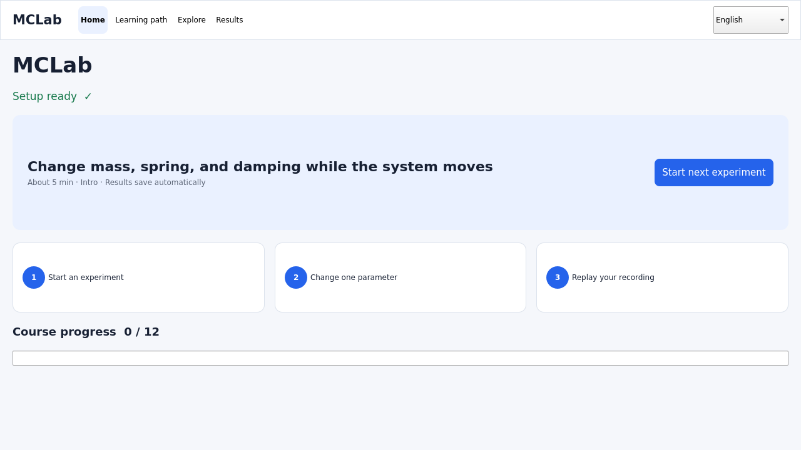

# MCLab

[한국어](README.md)

[](https://github.com/ycpiglet/manipulator-control-tutorial/actions/workflows/ci.yml)
[](https://github.com/ycpiglet/manipulator-control-tutorial/actions/workflows/desktop.yml)
[](LICENSE)
[](LICENSE-docs)

**A local learning lab where you change robot-control parameters and explain the resulting MuJoCo dynamics with saved evidence.**

MCLab connects a 1D mass–spring–damper system, PID, 2DOF Jacobian/DLS, and
7DOF Franka Panda Cartesian control and virtual-wall contact through one
learning workflow.

> [!IMPORTANT]
> This is a **v0.1.0 project under active development** and is currently
> source-first. Desktop bundles produced by CI are unsigned development
> artifacts. MCLab is an educational simulator, not an industrial digital
> twin or a safety controller for physical robots.



## What this repository does

- **One learning loop:** predict → run → change one variable → observe → save
  → replay and compare.
- **Safe failure-driven experiments:** reproduce excessive stiffness, low
  damping, PID windup, Jacobian singularities, and virtual-wall contact without
  risking hardware.
- **Evidence, not screenshots alone:** keep the resolved YAML, CSV/NPZ logs,
  replay, report, worksheet, and selected plots in one run directory.
- **Local-first operation:** use the desktop app or headless runs without an
  account or cloud service.

MCLab is for students learning robot control, educators who need reproducible
classroom demonstrations, and developers who want to inspect the dynamic
response of control algorithms.

## What you learn

| Lab | System | Core ideas | Representative evidence |
|---|---|---|---|
| Lab01 | 1D mass–spring–damper | stiffness, damping, energy, settling | position, velocity, force, energy |
| Lab02 | 1D PID control | P/I/D, saturation, anti-windup, delay, noise | tracking error, overshoot, control effort |
| Lab03 | Planar 2DOF arm | trajectories, FK/IK, Jacobians, singularities, DLS | joint/hand error, torque, condition number |
| Lab04 | 7DOF Franka Panda | hold, Cartesian reach, impedance, virtual wall | hand error, contact force, penetration |

The recommended app path has 12 steps. Explore also contains more than 70
guided baseline, comparison, and failure scenarios.

## Quick start

Python 3.10 or newer is required. The first launch creates a dedicated
`.venv`, installs dependencies, and downloads the verified Panda asset, so it
needs an internet connection and may take a few minutes.

```bash
git clone https://github.com/ycpiglet/manipulator-control-tutorial.git
cd manipulator-control-tutorial
```

| Platform | Recommended launcher |
|---|---|
| Windows | Double-click `START_HERE.cmd` |
| Ubuntu/Linux | `./start_here.sh` |
| macOS | `./START_HERE.command` |

After the app opens:

1. Select **Start next experiment**.
2. Select **Push**, change **Damping**, and select **Play**.
3. When the run finishes, open **View saved results** and **Replay recording**.
4. Use `report.html` to explain the position response and priority plot.

**Automated first source-run criterion:** on Windows, Linux, and macOS, the
recommended launcher completes setup and the app self-test, `doctor` and Lab01
exit successfully, and the saved result contains `report.html` plus at least
one `plots/*.png`. **View saved results** and **Replay recording** remain the
hands-on learner checks above.

<details>
<summary>Install manually or create a headless result from a terminal</summary>

For manual setup:

```bash
python -m venv .venv
```

Windows PowerShell:

```powershell
.\.venv\Scripts\Activate.ps1
```

Linux/macOS:

```bash
source .venv/bin/activate
```

Then, on every platform:

```bash
python -m pip install -e ".[app]"
python -m mclab assets install
python -m mclab doctor
python -m mclab app
```

You can also create a first headless report and plot without Qt:

```bash
python -m pip install -e .
python -m mclab run lab01 --config configs/lab01_msd/default.yaml --headless --plot --plots essential
```

See the [installation guide](docs/installation.md) for setup and packaging
details.

</details>

## Saved evidence

Each source run normally creates the following under `outputs/`. An explicit
output-directory setting takes precedence:

- `config.yaml`: the resolved configuration used for the calculation
- `log.csv`, `states.npz`, and `summary.json`: signals and summary values
- `replay.npz`: qpos/qvel/ctrl state recording
- `manifest.json`: scenario, seed, runtime, model/license, and artifact hashes
- `report.html` and `worksheet.md`: interpretation and review
- `plots/*.png` when `--plot` is requested
- learner events, snapshot, and tuned YAML for hands-on runs

**Replay recording** displays the saved state without recomputing physics.
**Run again with same settings** performs a new calculation with the same
config and seed. The app does not delete saved runs automatically.

## Repository map

| Path | Purpose |
|---|---|
| `src/mclab/` | CLI, integrated desktop app, and shared simulation loop |
| `src/mclab/controllers/` | readable PID, PD, task-space, and impedance laws |
| `src/mclab/labs/` | Lab01–04 physics and control assembly |
| `configs/` | reproducible YAML experiments and comparisons |
| `models/`, `third_party/` | local MuJoCo scenes and licensed external assets |
| `tests/` | unit, smoke, report, and desktop regression checks |
| `docs/` | learner, educator, developer, installation, and support material |
| `paper/`, `jose/`, `outreach/` | papers and outreach verified by the same experiments |
| `.agents/` | project state, audits, validation gates, and session handoffs |
| `outputs/` | generated evidence; Git tracks only `.gitkeep` |

The core package is already separated by responsibility. Root
`run_lab*.cmd` and `run_batch*.cmd` files are compatibility launchers for
existing classroom workflows. New users should use one of the three
`START_HERE` launchers or the integrated app.
See [repository structure and compatibility](docs/repository_structure.md) for
the no-move rationale and the rules that apply to any future consolidation.

## Documentation

- Learners: [learner guide](docs/learner_guide.md), [Lab01](docs/lab01_mass_spring_damper.md),
  [Lab02](docs/lab02_pid_control.md), [Lab03](docs/lab03_trajectory_planning.md),
  [Lab04](docs/lab04_panda_manipulator.md)
- Educators: [educator guide](docs/educator_guide.md)
- Developers: [desktop architecture](docs/developer_guide.md),
  [repository structure and compatibility](docs/repository_structure.md),
  [contribution guide](CONTRIBUTING.md)
- Installation and support: [installation](docs/installation.md),
  [troubleshooting](docs/troubleshooting.md)
- Research and citation: [tutorial paper (Korean)](paper/README.md),
  [JOSE software paper](jose/paper.md)
- Full index: [documentation map](docs/README.md)

## Development status

Lab01–04, the CLI/app, logging, reports, replay, and automated tests are
operational. General public beta and production distribution still require
signing/notarization, complete third-party notices, and real OS/GPU, screen
reader, and beginner-user validation. UI and artifact schemas may change
during v0.1.

> [!NOTE]
> `mclab clean` is read-only by default. Under the configured MCLab output root,
> it selects only strict terminal manifests whose `schema_version` is the JSON
> integer `1` and whose status is `completed`, `stopped`, or `error`. Legacy,
> incomplete, and running results can remain visible but are not cleanup
> candidates. Both the displayed plan ID and `--yes` are required before runs
> move into recoverable quarantine; nothing is permanently deleted.
> **Results → Manage** uses the same strict rule after an exact folder-name entry
> and a stale-target check.

<details>
<summary>Output cleanup and restore commands, including platform data locations</summary>

> [!WARNING]
> Do not copy and run the `--apply` example immediately. First inspect every
> candidate printed by the default dry-run, and use `--apply ... --yes` only
> for that **same, separately approved plan ID**.

```bash
python -m mclab clean --keep 20
python -m mclab clean --keep 20 --apply PLAN_ID_FROM_DRY_RUN --yes
python -m mclab clean --list-trash
python -m mclab clean --restore RECEIPT_ID_FROM_LIST
```

An arbitrary directory cannot be cleaned with `--output-dir`; set
`MCLAB_DATA_DIR` first to change the parent data location; MCLab uses only its
`outputs/` child. Replace each placeholder above with the ID printed by the
preceding command. `--list-trash` shows the full receipt history and current
state; only IDs marked `restorable` can be passed to `--restore`. `busy` means
another cleanup or restore is active for the same output root; wait for it to
finish and list the receipts again. The installed GUI bundle currently exposes
neither a cleanup/receipt console nor a receipt-restore button. Listing and
restore are therefore supported only from a source or virtual environment that
can run the `python -m mclab` commands above. To restore a run quarantined by
the packaged GUI, first point that source/venv CLI at the **same packaged data
parent**:

| OS where the packaged GUI ran | Run first in the source/venv terminal |
|---|---|
| Windows PowerShell | `$env:MCLAB_DATA_DIR = Join-Path $env:LOCALAPPDATA "MCLab"` |
| macOS zsh | `export MCLAB_DATA_DIR="$HOME/Library/Application Support/MCLab"` |
| Linux shell | `export MCLAB_DATA_DIR="${XDG_DATA_HOME:-$HOME/.local/share}/mclab"` |

Then refresh the list with `python -m mclab clean --list-trash` and run
`python -m mclab clean --restore RECEIPT_ID_FROM_LIST`. If the GUI was launched
with an explicit `MCLAB_DATA_DIR`, use that same parent instead of the table's
default. Omitting this step points a source checkout at its own `outputs/`, so
the packaged GUI receipt will not appear. Cleanup and restore are supported
and validated only on local filesystems. Do not run them on network filesystems
such as NFS or SMB; move the results to a local MCLab data location first.
Quarantine still uses disk space, and SAFE-01 intentionally does not expose
permanent purge.

</details>

See the [2026-07-20 readiness audit](.agents/reviews/20260720_enterprise_readiness_audit.md)
for the original findings and decision at that time, [CURRENT_STATE](.agents/CURRENT_STATE.md)
for the live handoff, and
[READINESS_EXECUTION_PLAN](.agents/READINESS_EXECUTION_PLAN.md) for the
authoritative work order.

## Development and contributing

```bash
python -m pip install -e ".[app,dev]"
python -m pytest -q
python -m ruff check src tests scripts .agents/validation
python -m mclab app --self-test
```

Every new config needs a learning guide and a suggested next experiment. See
[CONTRIBUTING.md](CONTRIBUTING.md) for the complete rules and pull-request
checklist.

## Citation and licenses

If you use MCLab in teaching or research, please cite it using
[CITATION.cff](CITATION.cff).

- Code: [Apache License 2.0](LICENSE)
- Documentation and educational content: [CC BY 4.0](LICENSE-docs)
- Noto fonts: [SIL Open Font License](third_party/fonts/noto/OFL.txt)
- Franka Panda model: the original MuJoCo Menagerie license, preserved by the
  [verified asset installer](src/mclab/application/assets.py)

Other dependencies remain under their respective upstream licenses. A signed
production bundle and consolidated third-party notice are not yet available.
