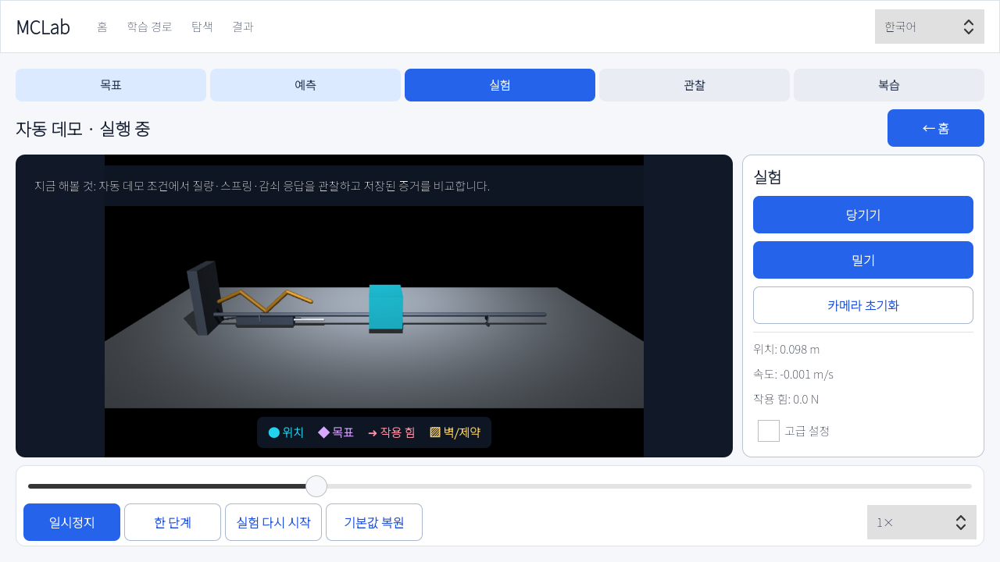

# MCLab

MuJoCo 기반 로봇 제어 학습 앱입니다. 질량–스프링–감쇠 1D 시스템에서 시작해 PID, 2DOF Jacobian/DLS, Franka Panda 가상 벽까지 같은 방식으로 예측하고 조작하고 증거를 저장합니다.

[English README](README.en.md)


## 가장 빠른 시작

1. `다음 실험 시작`을 누릅니다.
2. `밀기`로 움직임을 만든 뒤 `감쇠` 값을 바꾸고 `재생`을 누릅니다.
3. 완료 후 `기록 재생`으로 저장된 상태를 그대로 다시 보고 priority plot을 설명합니다.

처음 실행할 때만 Python 환경과 Panda 모델을 준비하므로 몇 분이 걸릴 수 있습니다.

| 운영체제 | 소스에서 시작 |
|---|---|
| Windows 11 x64 | `START_HERE.cmd` 더블클릭 |
| Ubuntu 24.04 x64 | `./start_here.sh` |
| macOS arm64/Intel | `./START_HERE.command` |

릴리스 ZIP/AppImage/DMG는 각 OS에서 별도로 빌드합니다. 서명되지 않은 CI 산출물은 개발 검증용이며 production 릴리스가 아닙니다.

## 직접 설치

Python 3.10 이상이 필요합니다.

```bash
python -m venv .venv
source .venv/bin/activate            # Windows: .venv\Scripts\activate
python -m pip install -e '.[app]'
python -m mclab assets install
python -m mclab doctor
python -m mclab app
```

MCLab 앱은 사용자당 하나만 실행됩니다. 런처를 다시 누르면 두 번째 GPU 프로세스를 만들지 않고 기존 창을 복원해 앞으로 가져옵니다.

Qt 없이 headless 실험만 사용할 수 있습니다.

```bash
python -m pip install -e .
python -m mclab run lab01 \
  --config configs/lab01_msd/default.yaml \
  --headless --plot --plots essential
```

## 앱 구조

- `홈`: 설정 상태, 최근 실행, 진행률, `다음 실험 시작`
- `학습 경로`: 권장 실험 순서, 성공 실행 기준 진행률, 다음 행동
- `탐색`: 70개 시나리오 검색, 난이도·방식 필터, 결과 없음 초기화
- `결과`: 실행 용량, report/plot, 기록 재생

첫 실행 홈은 640×360에서도 `시작 → 값 변경 → 기록 재생` 3단계와 `다음 실험 시작`을 한 화면에 표시합니다. `건너뛰기` 뒤에는 다음 실험으로 키보드 포커스가 이동하고, 홈 제목 옆 `둘러보기 다시 보기`로 언제든 복원할 수 있습니다. 설정 문제가 있으면 둘러보기보다 원인·복구 행동을 먼저 표시합니다.

첫 Lab01은 0.00초에 일시정지된 채 열리고 키보드 포커스가 `밀기`로 이동합니다. 기본 화면에는 `당기기`·`밀기`와 핵심 파라미터 `감쇠` 하나만 보여서 둘러보기의 세 단계를 그대로 수행할 수 있습니다. 이 앱 전용 준비 상태는 같은 YAML의 CLI/headless 계산을 멈추지 않습니다.

탐색에서는 검색어와 `난이도 · 전체`, `방식 · 전체` 필터를 함께 사용할 수 있고 현재 표시 수를 즉시 확인할 수 있습니다. `lab04 wall`처럼 여러 단어를 입력하면 순서와 관계없이 모든 단어가 있는 실험을 찾습니다. 결과가 0개면 원인 안내와 `필터 초기화`가 나타나며, 검색→난이도→방식→초기화 흐름은 키보드만으로도 완료됩니다.

실험 화면은 `목표 → 예측 → 실험 → 관찰 → 복습` 순서입니다. 물리는 예측을 확정한 뒤 0.00초부터 시작하므로 생각하는 시간에 따라 결과가 달라지지 않습니다. 중앙 MuJoCo 장면, 오른쪽 핵심 제어 최대 5개, 아래쪽 Pause/Step/Reset/속도/timeline이 항상 보입니다.

실행이 증거보다 먼저 끝나면 `다시 시작` 하나만 주요 행동으로 표시되고, 키보드 Enter로 재시작하면 0.00초의 예측 입력으로 돌아갑니다. 예측·조작·관찰이 모두 저장된 경우에만 `저장 결과 보기`가 주요 행동이 됩니다.

예측 입력은 실험 문맥을 따릅니다. 감쇠·P 게인·추종·특이점·관절/손끝 목표·가상 벽 접촉 힘 중 현재 실험에 맞는 짧은 가설 예시가 한국어와 영어로 표시됩니다. 200% 확대에서도 핵심 관찰량이 먼저 보이도록 문장을 구성했습니다.

Lab01/02 장면은 스프링·댐퍼·질량 블록·평형점을 직접 라벨하고 밝은 바닥, 눈금, 현재 원형, 목표 마름모를 함께 표시합니다. GPU 복구용 안전 모드에서도 같은 교육 도식이 움직여 빈 화면 대신 실험 관계를 유지합니다.

Lab03/04 안전 모드도 빈 십자선을 사용하지 않습니다. 1D 추종 rail, 번호가 있는 2DOF 팔과 작업공간, 단순화한 Panda 팔, 격자 가상 벽을 현재/목표 의미색과 함께 표시합니다.

실험 중 다른 화면으로 이동하면 물리와 기록이 자동으로 일시정지됩니다. 홈·학습 경로·탐색·결과 상단의 세션 바에서 `실험으로 돌아가기` 또는 `종료하고 저장`을 선택할 수 있습니다.
세션 바가 보이는 동안 새 실험·기록 재생·재실행·삭제는 비활성화되며, 리포트와 폴더는 계속 확인할 수 있습니다.

권장 경로의 마지막 전체 비교는 별도 프로세스에서 실행됩니다. 탐색·결과 상단의 비교 상태 바에서 현재 세트와 `비교 실행 취소`를 확인할 수 있고, 완료 전에는 새 실험·기록 재생·재실행만 비활성화됩니다. 기존 리포트·폴더와 실행 중 비교가 아닌 저장 결과 정리는 계속 사용할 수 있습니다.



키보드에서는 `Tab`/`Shift+Tab`으로 이동하고 `Enter` 또는 `Space`로 버튼을 누릅니다. 실험 장면에서 `Space`는 일시정지, 오른쪽 화살표는 한 단계 진행입니다. 마우스 왼쪽 드래그는 orbit, 오른쪽 드래그는 pan, wheel은 zoom입니다.

## 공개 명령

```text
mclab app [--lang ko|en] [--scenario ID] [--safe-mode]
mclab replay <run-dir>
mclab doctor [--json]
mclab assets install
mclab run ...
mclab batch ...
mclab coverage
mclab review
mclab index --open
```

`mclab menu`는 새 앱의 alias입니다. 기존 `run --viewer`는 고급/호환 경로로 남아 있으며 macOS에서는 `mjpython`을 자동 선택합니다.

## 기록과 재현

모든 새 실행은 다음 산출물을 남깁니다.

- `config.yaml`: 실행에 사용한 YAML
- `log.csv`: 기본 100 Hz 교육용 신호
- `states.npz`: 압축 수치 로그
- `replay.npz`: 기본 60 fps qpos/qvel/ctrl/semantic state
- `manifest.json`: scenario ID, 상태, seed, 런타임/OS, 모델·라이선스·artifact SHA-256
- `plots/*.png`, `report.html`, `worksheet.md`
- 직접 튜닝 시 `interaction_events.json`, `learner_snapshot.json`, `learner_tuned_config.yaml`

세 버튼의 뜻은 다릅니다.

- `기록 재생`: 저장 상태를 물리 재계산 없이 재생
- `같은 설정으로 다시 실행`: resolved config와 seed로 새 계산
- `마지막 튜닝으로 실행`: 저장된 `learner_tuned_config.yaml`로 새 계산

`결과` 화면은 먼저 한 문장 결과, 중요한 수치 3개, 권장 다음 행동을 보여주고 `리포트 보기`를 주요 행동으로 둡니다. 재실행·마지막 튜닝·폴더 열기·영구 삭제는 `관리` 안에 있습니다. MCLab은 결과를 자동 삭제하지 않으며, 정리할 때는 용량과 삭제할 폴더를 확인합니다.

기존 output은 계속 열고 재실행할 수 있습니다. qpos/qvel/ctrl이 없는 legacy 결과에서는 `기록 재생`이 비활성화되고 이유가 표시됩니다.

## 학습 경로

1. Lab01 1D 물리와 직접 조작
2. Lab02 PID와 live tuning
3. Lab03 2DOF 관절/작업공간/Jacobian/DLS
4. Lab04 Panda hold/Cartesian reach/virtual wall
5. 전체 comparison batch와 worksheet review

정확한 다음 단계는 앱의 `학습 경로` 또는 다음 명령에서 확인합니다.

권장 12단계의 마지막은 전체 비교 5세트입니다. 별도 프로세스에서 실행되어 앱은 계속
사용할 수 있고, `2/5 · PID 제어`처럼 현재 주제와 진행·취소가 표시됩니다. 완료 후
`결과`에서 통합 리포트와 학습 활동지를 검토합니다.

```bash
python -m mclab next --preview
python -m mclab next
python -m mclab review
```

## 개발과 검증

```bash
python -m pip install -e '.[app,dev]'
python -m pytest -q
python -m ruff check src tests scripts
QT_QPA_PLATFORM=offscreen python -m mclab app --self-test
# dev extra 설치 후: python scripts/audit_report_ui.py --help
```

핵심 원칙은 MuJoCo 물리, YAML 재현성, 기본 로그/plot 저장, 읽기 쉬운 controller 수식의 유지입니다. 웹 실시간 앱, ROS2, Isaac Sim, 새 CAD 모델은 현재 범위가 아닙니다.

## 문제 해결

- 앱 의존성 없음: `python -m pip install -e '.[app]'`
- GPU/GL 실패: `python -m mclab app --safe-mode`
- Panda asset 없음: `python -m mclab assets install`
- 설정 진단: `python -m mclab doctor --json`
- 손상된 기록: 같은 scenario를 다시 실행해 새 `replay.npz`를 만듭니다.
- macOS passive viewer: 앱이 아닌 기존 viewer를 쓸 때 `mjpython`이 필요합니다.

자세한 문서:

- [설치와 배포](docs/installation.md)
- [초보 학습자 가이드](docs/learner_guide.md)
- [교육자 가이드](docs/educator_guide.md)
- [개발자 구조](docs/developer_guide.md)
- [문제 해결](docs/troubleshooting.md)

## 라이선스

프로젝트 코드는 Apache-2.0입니다. Franka Panda 모델은 MuJoCo Menagerie 원본 `LICENSE`를 그대로 보존합니다. `mclab assets install`은 고정 commit archive의 SHA-256을 확인한 뒤 Panda 폴더와 원본 라이선스만 설치합니다.
