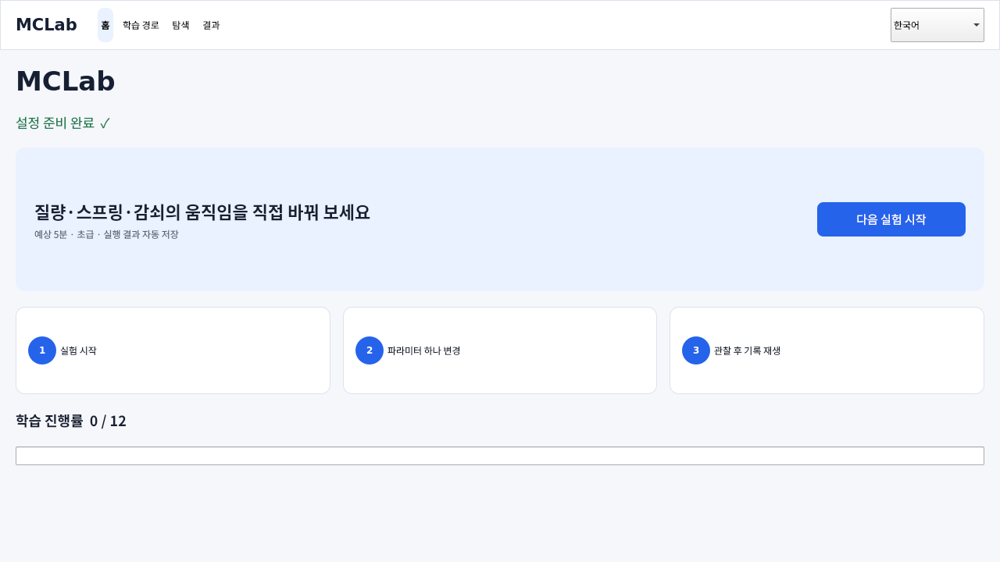

# MCLab

[English](README.en.md)

[](https://github.com/ycpiglet/manipulator-control-tutorial/actions/workflows/ci.yml)
[](https://github.com/ycpiglet/manipulator-control-tutorial/actions/workflows/desktop.yml)
[](LICENSE)
[](LICENSE-docs)

**로봇 제어 파라미터를 직접 바꾸고, MuJoCo 동역학의 변화를 저장된 증거로 설명하는 로컬 학습실입니다.**

MCLab은 질량–스프링–감쇠 1D 시스템에서 시작해 PID, 2DOF
Jacobian/DLS, 7DOF Franka Panda의 Cartesian 제어와 가상 벽 접촉까지
하나의 학습 흐름으로 연결합니다.

> [!IMPORTANT]
> 현재 버전은 **v0.1.0 개발 중**이며 소스 실행을 우선 지원합니다.
> CI가 만드는 데스크톱 번들은 서명되지 않은 개발 산출물입니다. MCLab은
> 교육용 시뮬레이터이며 산업용 디지털 트윈이나 실물 로봇 안전 제어기가 아닙니다.



## 이 저장소가 하는 일

- **한 가지 흐름으로 학습합니다:** 예측 → 실행 → 한 변수 변경 → 관찰 →
  저장 → 재생·비교.
- **실패를 안전하게 경험합니다:** 과도한 강성, 낮은 감쇠, PID 적분
  포화(windup), Jacobian 특이점, 가상 벽 충돌을 재현 가능한 실험으로
  다룹니다.
- **결과를 증거로 남깁니다:** 확정된 YAML, CSV/NPZ 로그, 상태 기록,
  report, worksheet와 선택한 그래프가 한 실행 폴더에 저장됩니다.
- **로컬에서 동작합니다:** 계정이나 클라우드 서비스 없이 앱과 headless
  실험을 실행할 수 있습니다.

대상 독자는 로봇 제어를 처음 배우는 학생, 강의용 재현 데모가 필요한 교육자,
그리고 제어 알고리즘의 동역학 응답을 빠르게 확인하려는 개발자입니다.

## 학습 내용

| Lab | 시스템 | 핵심 개념 | 대표 증거 |
|---|---|---|---|
| Lab01 | 1D 질량–스프링–감쇠 | 강성, 감쇠, 에너지, 정착 | 위치·속도·힘·에너지 |
| Lab02 | 1D PID 제어 | P/I/D, 포화, anti-windup, 지연, 잡음 | 추종 오차·overshoot·제어력 |
| Lab03 | 2DOF 평면 팔 | 궤적, FK/IK, Jacobian, 특이점, DLS | 관절/손끝 오차·torque·조건수 |
| Lab04 | 7DOF Franka Panda | 자세 유지, 직교좌표 도달, impedance, 가상 벽 | 손끝 오차·접촉력·침투 깊이 |

앱의 권장 학습 경로는 12단계이고, 탐색 화면에는 기본 실험과 비교·실패
시나리오를 포함한 70개 이상의 안내 시나리오가 있습니다.

## 빠른 시작

CPython 3.10, 3.11 또는 3.12가 필요합니다. 첫 실행은 전용 `.venv`를 만들고
hash로 잠근 wheel 의존성과 검증된 Panda asset을 내려받으므로 인터넷 연결과
몇 분이 필요할 수 있습니다.

```bash
git clone https://github.com/ycpiglet/manipulator-control-tutorial.git
cd manipulator-control-tutorial
```

| 검토된 의존성 잠금 대상 | 권장 실행 |
|---|---|
| Windows 10 1809 이상 또는 Windows 11, AMD64 | `START_HERE.cmd` 더블클릭 |
| Linux x86-64, glibc 2.34 이상 | `./start_here.sh` |
| macOS 13 이상, Apple Silicon 또는 Intel | `./START_HERE.command` |

이 표는 데스크톱 앱의 의존성 잠금 대상이며 전체 호환성 인증표는 아닙니다.
Windows·Linux·macOS native CI는 CPython 3.11을 실행하고, Linux headless CI는
3.10과 3.12도 실행합니다. 나머지 조합은 cross-target wheel 검증까지만 완료되어
native 검증이 남아 있습니다. 그 밖의 OS·아키텍처에서는 설치기가 네트워크 접근
전에 잠금 대상이 아님을 설명하고 중단합니다.

앱이 열리면 다음 순서로 첫 결과를 만듭니다.

1. **다음 실험 시작**을 선택합니다.
2. **밀기**로 움직임을 만들고 **감쇠** 값을 바꾼 뒤 **재생**합니다.
3. 실행이 끝나면 **저장 결과 보기**와 **기록 재생**으로 응답을 확인합니다.
4. 생성된 `report.html`에서 위치 응답과 가장 중요한 그래프를 설명합니다.

**첫 소스 실행의 자동 검증 기준:** Windows, Linux, macOS의 권장 실행기가 설치와
앱 self-test를 완료하고, `doctor`와 Lab01이 오류 없이 끝나며, 저장 결과에
`report.html`과 하나 이상의 `plots/*.png`가 생성됩니다. 앱의 **저장 결과 보기**와
**기록 재생**은 위에서 학습자가 직접 확인하는 hands-on 단계입니다.

<details>
<summary>터미널에서 직접 설치하거나 headless 결과 만들기</summary>

직접 환경을 구성하려면:

```bash
python -m venv .venv
```

Windows PowerShell:

```powershell
.\.venv\Scripts\Activate.ps1
```

Linux/macOS:

```bash
source .venv/bin/activate
```

가상환경을 활성화한 뒤 모든 OS에서:

```bash
python scripts/install_locked.py app
python -m mclab assets install
python -m mclab doctor
python -m mclab app
```

Qt 앱 없이 첫 headless report와 plot을 만들 수도 있습니다.

```bash
python scripts/install_locked.py runtime
python -m mclab run lab01 --config configs/lab01_msd/default.yaml --headless --plot --plots essential
```

설치·패키징 세부사항은 [설치 문서](docs/installation.md)를 참고하세요.

</details>

## 저장되는 결과

각 소스 실행은 기본적으로 `outputs/` 아래에 다음 자료를 남깁니다. 출력
경로를 따로 지정한 경우에는 해당 위치에 저장됩니다.

- `config.yaml`: 실제 계산에 사용한 확정 설정
- `log.csv`, `states.npz`, `summary.json`: 수치 신호와 요약값
- `replay.npz`: qpos/qvel/ctrl 기반 상태 재생
- `manifest.json`: scenario, seed, 런타임, 모델·라이선스·artifact hash
- `report.html`, `worksheet.md`: 결과 해석과 복습
- `--plot` 사용 시 `plots/*.png`
- 직접 조작 시 learner event, snapshot, tuned YAML

**기록 재생**은 저장 상태를 그대로 보여주고, **같은 설정으로 다시 실행**은
동일한 config와 seed로 물리를 새로 계산합니다. 앱은 저장 결과를 자동으로
삭제하지 않습니다. 학습자 예측·관찰 메모가 저장되고 파생되는 위치와 공용 PC
주의사항, 확인된 runtime cache 위치는
[로컬 데이터와 개인정보 안내](docs/local_data_and_privacy.md)를 확인하세요. Cache
목록은 제한된 범위이며 공용 PC 전체 정리 완료를 뜻하지 않습니다.

## 저장소 구조

| 경로 | 역할 |
|---|---|
| `src/mclab/` | CLI, 통합 데스크톱 앱, 공통 simulation loop |
| `src/mclab/controllers/` | 읽기 쉬운 PID·PD·task-space·impedance 제어식 |
| `src/mclab/labs/` | Lab01–04 물리와 제어 조립 코드 |
| `configs/` | 재현 가능한 YAML 실험과 비교 시나리오 |
| `models/`, `third_party/` | 로컬 MuJoCo scene과 라이선스가 보존된 외부 asset |
| `tests/` | unit, smoke, report, desktop 회귀 검증 |
| `docs/` | 학습자·교육자·개발자·설치·문제 해결 문서 |
| `paper/`, `jose/`, `outreach/` | 같은 실험으로 검증하는 논문·투고·교육 확산 자료 |
| `.agents/` | 프로젝트 상태, 감사, 검증 기준과 세션 인수인계 |
| `outputs/` | 생성 결과; Git에는 `.gitkeep`만 포함 |

코어 패키지 구조는 이미 역할별로 분리되어 있습니다. 루트의
`run_lab*.cmd`와 `run_batch*.cmd`는 기존 수업·호환용 실행기이며,
신규 사용자는 세 개의 `START_HERE` 실행기나 통합 앱을 사용하면 됩니다.
현재 경로를 유지하는 이유와 향후 이동 시 지킬 호환 규칙은
[저장소 구조와 호환성 경계](docs/repository_structure.md)에 기록되어 있습니다.

## 문서 안내

- 학습자: [학습자 가이드 (영문)](docs/learner_guide.md),
  [Lab01 (영문)](docs/lab01_mass_spring_damper.md),
  [Lab02 (영문)](docs/lab02_pid_control.md), [Lab03 (영문)](docs/lab03_trajectory_planning.md),
  [Lab04 (영문)](docs/lab04_panda_manipulator.md)
- 교육자: [교육자 가이드 (영문)](docs/educator_guide.md)
- 개발자: [개발자 구조 (영문)](docs/developer_guide.md),
  [저장소 구조와 호환성 (영문 중심)](docs/repository_structure.md),
  [기여 방법 (영문)](CONTRIBUTING.md)
- 설치·운영: [설치와 배포 (영문)](docs/installation.md),
  [문제 해결 (영문)](docs/troubleshooting.md),
  [로컬 데이터와 개인정보 (한·영 병기)](docs/local_data_and_privacy.md)
- 연구·인용: [튜토리얼 논문 (한국어)](paper/README.md),
  [JOSE 소프트웨어 논문 (영문)](jose/paper.md)
- 전체 색인: [Documentation map (영문 중심)](docs/README.md)

## 개발 상태

핵심 Lab01–04, CLI/앱, 로깅, report/replay와 자동 테스트는 동작하지만,
일반 공개 베타와 정식 배포를 위한 서명·notarization, 전체
third-party 고지, 실제 OS/GPU·스크린리더·초보 사용자 검증은 남아 있습니다.
UI와 artifact schema도 v0.1 기간에는 변경될 수 있습니다.

> [!NOTE]
> `mclab clean`은 기본적으로 읽기 전용 계획만 출력합니다. 설정된 MCLab output
> root에서 `schema_version`이 JSON 정수 `1`이고 상태가 `completed`, `stopped`,
> `error` 중 하나인 strict 종료 manifest만 대상으로 삼습니다. legacy·불완전·실행 중
> 결과는 표시될 수 있지만 정리 대상이 아닙니다. 표시된 plan ID와 `--yes`를 함께
> 제공해야 복구 보관소로 이동하며 영구 삭제하지 않습니다. 앱의 **결과 → 관리**도
> 정확한 폴더명 입력과 변경 감지 뒤 같은 strict 기준과 보관소를 사용합니다.

<details>
<summary>출력 정리·복원 명령과 플랫폼별 데이터 위치</summary>

> [!WARNING]
> 아래 `--apply` 예시를 바로 복사해 실행하지 마세요. 먼저 기본 dry-run이 표시한
> 모든 후보를 검토하고, 별도로 승인한 **동일한 plan ID**에만 `--apply ... --yes`를
> 사용하세요.

```bash
python -m mclab clean --keep 20
python -m mclab clean --keep 20 --apply PLAN_ID_FROM_DRY_RUN --yes
python -m mclab clean --list-trash
python -m mclab clean --restore RECEIPT_ID_FROM_LIST
```

`--output-dir`로 임의 폴더를 정리할 수 없습니다. 사용자 데이터 위치를 바꾸려면 먼저
`MCLAB_DATA_DIR`를 설정하세요. 이 값은 데이터 상위 폴더이며 MCLab은 그 아래
`outputs/`만 사용합니다. 위 placeholder는 바로 앞 명령이 표시한 실제 ID로 바꾸세요.
`--list-trash`는 전체 receipt 이력과 현재 상태를 표시합니다. 그중 `restorable`로
표시된 ID만 `--restore`에 사용할 수 있습니다. `busy`는 다른 cleanup 또는 restore가
같은 output root에서 진행 중이라는 뜻이므로 그 작업이 끝난 뒤 목록을 새로 확인하세요.
현재 설치형 GUI 번들은 cleanup/receipt용 콘솔과 receipt 복원 버튼을 제공하지
않습니다. 따라서 목록 확인과 복원은 위 `python -m mclab` 명령을 사용할 수 있는
소스 또는 가상환경에서만 지원됩니다. 패키지 GUI에서 격리한 실행을 복원할
때는 소스/venv CLI가 **같은 패키지 데이터 상위 폴더**를 보도록 먼저 설정합니다.

| 패키지 GUI를 실행한 OS | 소스/venv 터미널에서 먼저 실행 |
|---|---|
| Windows PowerShell | `$env:MCLAB_DATA_DIR = Join-Path $env:LOCALAPPDATA "MCLab"` |
| macOS zsh | `export MCLAB_DATA_DIR="$HOME/Library/Application Support/MCLab"` |
| Linux shell | `export MCLAB_DATA_DIR="${XDG_DATA_HOME:-$HOME/.local/share}/mclab"` |

그런 다음 `python -m mclab clean --list-trash`로 목록을 새로 확인하고
`python -m mclab clean --restore RECEIPT_ID_FROM_LIST`를 실행하세요. GUI를
실행할 때 `MCLAB_DATA_DIR`를 직접 지정했다면 표의 기본값 대신 그와 같은 상위
폴더를 사용해야 합니다. 이 설정을 생략하면 source checkout의 `outputs/`를 보게
되어 패키지 GUI receipt가 목록에 나오지 않습니다. cleanup/restore의 지원·검증 범위는 로컬
파일시스템입니다. NFS/SMB 같은 네트워크 파일시스템에서는 실행하지 말고, 필요한
결과를 먼저 로컬 MCLab 데이터 위치로 옮기세요.
복구 보관소는 디스크 공간을 계속 사용하며, SAFE-01은
안전한 영구 purge를 의도적으로 제공하지 않습니다.

</details>

원래 감사 finding과 당시 판정은
[2026-07-20 readiness audit](.agents/reviews/20260720_enterprise_readiness_audit.md),
현재 작업 상태는 [CURRENT_STATE](.agents/CURRENT_STATE.md), 권위 있는 실행 순서는
[READINESS_EXECUTION_PLAN](.agents/READINESS_EXECUTION_PLAN.md)에 기록되어 있습니다.

## 개발과 기여

```bash
python scripts/install_locked.py app-dev
python -m pytest -q
python -m ruff check src tests scripts .agents/validation
python -m mclab app --self-test
```

새 config에는 학습 가이드와 다음 실험 연결이 필요합니다. 자세한 규칙과 PR
체크리스트는 [CONTRIBUTING.md](CONTRIBUTING.md)를 참고하세요.

## 인용과 라이선스

연구나 수업에서 사용했다면 [CITATION.cff](CITATION.cff)의 정보를 이용해
인용해 주세요.

- 코드: [Apache License 2.0](LICENSE)
- 문서·교육 콘텐츠: [CC BY 4.0](LICENSE-docs)
- Noto 폰트: [SIL Open Font License](third_party/fonts/noto/OFL.txt)
- Franka Panda 모델: [검증된 asset installer](src/mclab/application/assets.py)가
  보존하는 MuJoCo Menagerie 원본 라이선스

그 밖의 의존성은 각 원본 라이선스를 따릅니다. 서명된 정식 배포물과
통합 third-party notice는 아직 제공하지 않습니다.
